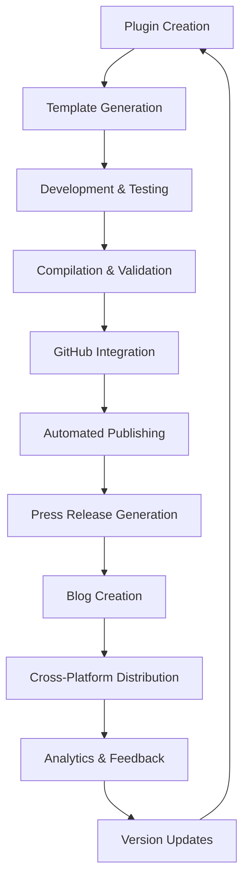

# Plugins Management System

Interactive plugin development and deployment platform with automated compilation, GitHub publishing, press release generation, and blog creation for the CLDCDE ecosystem.

**🚀 Full Lifecycle Management:**
- **Plugin Creation** - Templates and scaffolding for new plugins
- **Automated Compilation** - Build processes and package management
- **GitHub Integration** - Repository creation and management
- **Automated Publishing** -npm registry deployment
- **Press Release Generation** - Professional announcements
- **Blog Creation** - Content marketing automation
- **Cross-Platform Distribution** - Multiple registry support

**📋 Plugin Categories:**
- **Content Creation** - YouTube, social media, video tools
- **Development Tools** - Code generation, debugging utilities
- **Marketing Automation** - SEO, analytics, promotion
- **System Integration** - MCP servers, API tools
- **Visual Interface** - UI components, themes
- **Data Processing** - Analytics, optimization, filtering

## Interactive Menu System

### Main Interface
```bash
/plugins
```

**🔧 Plugin Management**
```
[1] Create New Plugin        - Templated scaffolding
[2] Compile Existing Plugin - Build and validation
[3] Push to GitHub          - Repository management
[4] Publish to npm          - Registry deployment
[5] Create Press Release    - Professional announcements
[6] Generate Blog Post      - Content marketing
[7] Update Plugin           - Version management
[8] Plugin Marketplace      - Browse and discover
```

**🎯 Quick Actions**
```
[a] YouTube Creator Template    - Video upload/management
[b] MCP Server Template         - Model Context Protocol
[c] Marketing Automation Tool   - Campaign management
[d] Development Utility         - Code assistance
[e] Visual Component Kit        - UI framework
[f] Data Processing Tool        - Analytics pipeline
```

## Plugin Creation Workflow

### Phase 1: Plugin Foundation
```
🔍 Plugin Type Selection:
┌─────────────────────────────────────┐
│ [1] Content Creation (YouTube, etc.) │
│ [2] Development Tools (Code gen)     │
│ [3] Marketing Automation            │
│ [4] System Integration (MCP/API)     │
│ [5] Visual Interface (UI/Themes)     │
│ [6] Data Processing (Analytics)      │
│ [7] Custom Template                  │
└─────────────────────────────────────┘
```

### Phase 2: Configuration & Metadata
```typescript
// Generated package.json
{
  "name": "@cldcde/plugin-name",
  "version": "1.0.0",
  "description": "Plugin description",
  "main": "dist/index.js",
  "types": "dist/index.d.ts",
  "scripts": {
    "build": "bun build src/index.ts --outdir dist --target node",
    "test": "bun test",
    "publish": "npm publish",
    "github-release": "gh release create"
  },
  "cldcde": {
    "type": "plugin",
    "category": "selected-category",
    "capabilities": [""],
    "compatibility": {"cldcde": ">=1.0.0"},
    "permissions": ["network:*", "storage:secure"],
    "security": {"credential-encryption": "AES-256"}
  }
}
```

### Phase 3: Implementation Structure
```
🛠️ Generated Plugin Structure:
your-plugin/
├── src/
│   ├── index.ts              # Main implementation
│   ├── types.ts              # Type definitions
│   └── utils.ts              # Helper functions
├── tests/
│   └── index.test.ts         # Unit tests
├── docs/
│   └── README.md             # Documentation
├── .claude-plugin/
│   └── plugin.json           # Claude plugin metadata
├── package.json              # Package configuration
└── tsconfig.json             # TypeScript config
```

## Automated Compilation System

### Build Process
```bash
# Automatic compilation with validation
bun run build                    # TypeScript compilation
bun run lint                     # Code quality check
bun run test                     # Unit test execution
bun run type-check               # TypeScript validation
```

### Package Validation
```typescript
// Pre-publish validation checklist
interface ValidationChecklist {
  ✅ TypeScript compilation: no errors
  ✅ Unit tests: 100% pass rate
  ✅ ESLint: no style violations
  ✅ Dependencies: compatible versions
  ✅ Security: vulnerability scan
  ✅ Documentation: README complete
  ✅ Plugin manifest: valid structure
}
```

## GitHub Integration

### Repository Creation
```bash
# Automated GitHub setup
gh repo create cldcde/your-plugin --public --clone
cd your-plugin

# Initial commit with template
git add .
git commit -m "Initial plugin scaffold - Your Plugin Name"
git push -u origin main
```

### Feature Branch Development
```bash
# Feature development workflow
git checkout -b feature/new-capability
# Develop and test
git commit -m "Add new capability with tests"
git push origin feature/new-capability
gh pr create --title "Add new capability" --body "Implementation details..."
```

## Automated Publishing Pipeline

### npm Registry Deployment
```typescript
// Automated publishing process
interface PublishPipeline {
  1. Version Management:        // Semantic versioning
  2. Build Verification:        // Compilation & testing
  3. Security Scanning:         // Vulnerability checks
  4. Documentation Update:      // README and API docs
  5. Package Publishing:        // npm upload
  6. GitHub Release:            // Tag creation
  7. Dependency Updates:        // Registry synchronization
}
```

### Cross-Platform Distribution
```bash
# Multi-registry publishing
npm publish                       # npm registry
npm publish --registry=https://npm.pkg.github.com  # GitHub packages
npm publish --registry=https://registry.yarnpkg.com  # Yarn registry
```

## Press Release Automation

### Professional Announcements
```markdown
# Press Release Template

## FOR IMMEDIATE RELEASE
### CLDCDE Releases [Plugin Name] - [Key Benefit]

**[City, State] - [Date]** - CLDCDE today announced the release of [Plugin Name], a revolutionary [category] tool that [main benefit]. The new plugin enables users to [primary use case] with [key features].

### Key Features
- [Feature 1]: [Benefit description]
- [Feature 2]: [Benefit description]  
- [Feature 3]: [Benefit description]

### Technical Capabilities
- Integration with [platforms/tools]
- Support for [standards/formats]
- Security features including [security aspects]
- Performance optimization with [performance benefits]

### Availability
[Plugin Name] is available immediately as an npm package (@cldcde/plugin-name) and can be installed via:
\`\`\`bash
npm install @cldcde/plugin-name
\`\`\`

### About CLDCDE
CLDCDE is the leading creator-focused development ecosystem, providing [CLDCDE mission/value]. With over [number] active users, CLDCDE continues to innovate in the [domain] space.

### Media Contact
[Contact information]
```

### Distribution Channels
```bash
# Automated press release distribution
# - GitHub Discussions announcement
# - Reddit communities (relevant subreddits)
# - Discord/Telegram channels
# - Twitter/X thread
# - LinkedIn article
# - Email newsletter blast
```

## Blog Creation Automation

### Content Marketing Generation
```typescript
// Blog post structure
interface BlogPostSchema {
  title: "How [Plugin Name] Revolutionizes [Use Case]";
  sections: [
    "Introduction - Problem statement",
    "Solution Overview - Plugin capabilities", 
    "Technical Deep Dive - Implementation details",
    "Use Cases - Real-world applications",
    "Getting Started - Installation guide",
    "Roadmap - Future development plans"
  ];
  seo: {
    title: "Complete Guide to [Plugin Name] - [Year]";
    description: "Learn how [Plugin Name] transforms [use case]";
    keywords: ["plugin", "CLDCDE", "category", "benefit"];
  };
}
```

### Multi-Platform Publishing
```bash
# Automated blog distribution
# 1. CLDCDE website blog section
# 2. Dev.to medium publication
# 3. Hashnode technical blog
# 4. LinkedIn article
# 5. Medium publication
# 6. Twitter thread summary
```

## Workflow Integration

### Complete Automation Pipeline


### Monitoring & Analytics
```typescript
// Deployment success metrics
interface DeploymentMetrics {
  npmDownloads: number;           // Package usage statistics
  githubStars: number;            // Repository popularity
  blogViews: number;              // Content engagement
  pressReleaseViews: number;      // Announcement reach
  communityFeedback: number;      // User responses
  bugReports: number;             // Quality indicators
  featureRequests: number;        // Enhancement requests
}
```

## Quick Start Examples

### Create YouTube Plugin
```bash
/plugins
# Select option 1 (Create New Plugin)
# Select category "a" (YouTube Creator Template)
# Provide plugin name: "video-analyzer"
# Configure capabilities: ["video-analysis", "metadata-extraction"]
# Complete guided setup
```

### Compile and Publish
```bash
/plugins
# Select option 2 (Compile)
# Select plugin: "video-analyzer"
# Automated build, test, validation
# Select option 4 (Publish)
# Automated npm deployment
```

### Full Release Cycle
```bash
/plugins
# Select option 5 (Press Release)
# Generate professional announcement
# Select option 6 (Blog Creation)
# Create marketing content
# Select option 4 (Publish)
# Deploy to all registries
# Automated distribution to channels
```

**🎯 Complete plugin ecosystem management from concept to market deployment with automated content creation and distribution.**

!`bash -lc "
echo '🚀 PLUGINS MANAGEMENT SYSTEM - FULL LIFECYCLE AUTOMATION'
echo '━━━━━━━━━━━━━━━━━━━━━━━━━━━━━━━━━━━━━━━━━━━━━━━━━━━━━━━━━━━━━━━━━━━━━━━━━━━━━━━━'
echo ''
echo '🔧 PLUGIN MANAGEMENT:'
echo '• Plugin creation with templates and scaffolding'
echo '• Automated compilation with build validation'
echo '• GitHub integration with repository management'
echo '• Automated publishing to multiple registries'
echo '• Professional press release generation'
echo '• Blog content creation with SEO optimization'
echo '• Cross-platform distribution and analytics'
echo ''
echo '📋 PLUGIN CATEGORIES:'
echo '• Content Creation - YouTube, social media, video tools'
echo '• Development Tools - Code generation, debugging utilities'
echo '• Marketing Automation - SEO, analytics, promotion'
echo '• System Integration - MCP servers, API tools'
echo '• Visual Interface - UI components, themes'
echo '• Data Processing - Analytics, optimization, filtering'
echo ''
echo '🎯 MAIN MENU OPTIONS:'
echo '1. Create New Plugin      - Templated scaffolding'
echo '2. Compile Existing Plugin - Build and validation'
echo '3. Push to GitHub        - Repository management'
echo '4. Publish to npm        - Registry deployment'
echo '5. Create Press Release  - Professional announcements'
echo '6. Generate Blog Post    - Content marketing'
echo '7. Update Plugin         - Version management'
echo '8. Plugin Marketplace    - Browse and discover'
echo ''
echo '🚀 QUICK ACTIONS:'
echo 'a. YouTube Creator Template    - Video upload/management'
echo 'b. MCP Server Template         - Model Context Protocol'
echo 'c. Marketing Automation Tool   - Campaign management'
echo 'd. Development Utility         - Code assistance'
echo 'e. Visual Component Kit        - UI framework'
echo 'f. Data Processing Tool        - Analytics pipeline'
echo ''
echo '💫 🎯 Choose your option or browse available templates'
echo '📚 Complete automation from concept to market deployment'
echo '🔗 Integration with npm, GitHub, and content platforms'
"`
