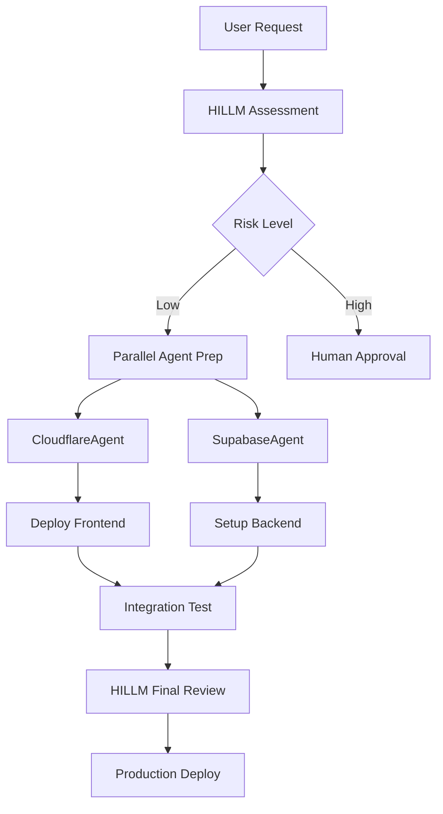

# AEGNT - Advanced Engineered General Network of Thinkers

An AI agent collaboration framework featuring CloudflareAgent, SupabaseAgent, and HILLM (Human-In-Loop Language Model) Supervisor for deploying and managing modern web applications.

## 🚀 Overview

AEGNT is a sophisticated multi-agent system designed for autonomous deployment and management of full-stack applications. It features:

- **CloudflareAgent**: Edge infrastructure specialist for Workers, Pages, KV, and more
- **SupabaseAgent**: Backend-as-a-Service orchestrator for database, auth, and storage
- **HILLM Supervisor**: High-IQ oversight system with exceptional standards
- **Collaboration Framework**: Open dialogue protocol for inter-agent communication
- **Deployment Orchestrator**: Practical implementation for coordinated deployments

## 📋 Features

### Intelligent Agents
- **Prompt Trees**: Hierarchical decision-making structures
- **Self-Checking**: Pre and post-operation validation
- **Learning System**: Persistent memory using knowledge graphs
- **Tool Integration**: Access to 50+ MCP tools and services

### HILLM Supervision
- **IQ 180+ Standards**: Zero tolerance for mediocrity
- **Quality Gates**: 99% code quality, 95% security minimum
- **DEFCON System**: Crisis management protocols
- **Veto Authority**: Can halt any operation

### Collaboration
- **Open Dialogue**: Natural agent-to-agent communication
- **Conflict Resolution**: Automated dispute handling
- **Parallel Execution**: Efficient task management
- **Shared Learning**: Cross-agent knowledge transfer

## 🛠️ Installation

```bash
# Clone the repository
git clone https://github.com/aegntic/cldcde.git
cd cldcde/aegnt

# Install dependencies
pip install -r requirements.txt
npm install

# Set up environment variables
cp .env.example .env
# Edit .env with your API keys
```

## 🔧 Configuration

### Required API Keys
```env
# Cloudflare
CLOUDFLARE_ACCOUNT_ID=your-account-id
CLOUDFLARE_API_TOKEN=your-api-token

# Supabase
SUPABASE_URL=https://your-project.supabase.co
SUPABASE_ANON_KEY=your-anon-key
SUPABASE_SERVICE_KEY=your-service-key

# Other Services (optional)
OPENAI_API_KEY=your-openai-key
GITHUB_TOKEN=your-github-token
```

## 📖 Usage

### Basic Deployment
```python
from aegnt import DeploymentOrchestrator

# Initialize orchestrator
orchestrator = DeploymentOrchestrator()

# Deploy a project
await orchestrator.deploy_project({
    "name": "my-app",
    "frontend": "cloudflare-pages",
    "backend": "cloudflare-workers",
    "database": "supabase"
})
```

### Agent Communication
```python
from aegnt import CloudflareAgent, SupabaseAgent, HILLM

# Agents collaborate automatically
cloudflare = CloudflareAgent()
supabase = SupabaseAgent()
hillm = HILLM()

# Example: Deploy with approval
deployment = await cloudflare.prepare_deployment()
approval = await hillm.review(deployment)
if approval.approved:
    await cloudflare.execute(deployment)
```

### Using Prompt Trees
```python
# Agents use prompt trees for decision making
agent = CloudflareAgent()
decision = await agent.evaluate({
    "task": "deploy-worker",
    "context": {"size": "1MB", "cpu_time": "10ms"}
})
# Agent automatically follows its prompt tree
```

## 📁 Project Structure

```
aegnt/
├── agents/               # Agent definitions
│   ├── cloudflare-agent.md
│   ├── supabase-agent.md
│   └── hillm-supervisor.md
├── tools/               # Tool configurations
│   ├── mcp-tools.json
│   └── integrations.yaml
├── prompts/            # Prompt templates
│   ├── deployment/
│   ├── optimization/
│   └── troubleshooting/
├── instructions/       # Operating procedures
│   ├── deployment-sop.md
│   └── security-protocols.md
├── examples/          # Usage examples
│   ├── basic-deployment.py
│   ├── multi-agent-collab.py
│   └── conflict-resolution.py
└── scripts/           # Utility scripts
    ├── setup.sh
    └── test-deployment.py
```

## 🧠 Agent Capabilities

### CloudflareAgent
- Deploy Workers and Pages
- Manage KV namespaces
- Configure custom domains
- Optimize performance
- Handle SSL/TLS
- Implement caching strategies

### SupabaseAgent
- Design database schemas
- Create RLS policies
- Deploy Edge Functions
- Configure authentication
- Manage storage buckets
- Set up real-time subscriptions

### HILLM Supervisor
- Review all operations
- Enforce quality standards
- Manage crisis situations
- Resolve agent conflicts
- Approve production deployments
- Continuous learning

## 🔄 Workflow Example



## 🛡️ Security

- All credentials stored as environment variables
- API keys never committed to code
- Automatic credential rotation reminders
- RLS policies enforced by default
- Security scoring on all operations

## 📊 Monitoring

AEGNT includes built-in monitoring:
- Agent performance metrics
- Decision audit trails
- Error tracking and recovery
- Resource usage monitoring
- Deployment success rates

## 🤝 Contributing

We welcome contributions! Please see our [Contributing Guide](CONTRIBUTING.md) for details.

### Development Setup
```bash
# Create virtual environment
python -m venv venv
source venv/bin/activate

# Install dev dependencies
pip install -r requirements-dev.txt

# Run tests
pytest tests/
```

## 📄 License

MIT License - see [LICENSE](LICENSE) file for details.

## 🔗 Links

- [Documentation](https://docs.aegntic.com)
- [Discord Community](https://discord.gg/aegntic)
- [Blog](https://blog.aegntic.com)
- [Examples](./examples)

## 🎯 Roadmap

- [ ] Visual agent monitoring dashboard
- [ ] More pre-built deployment templates
- [ ] Additional cloud provider agents
- [ ] Plugin system for custom agents
- [ ] Web UI for non-technical users

---

Built with ❤️ by the AEGNTIC team. Making deployment intelligent, one agent at a time.