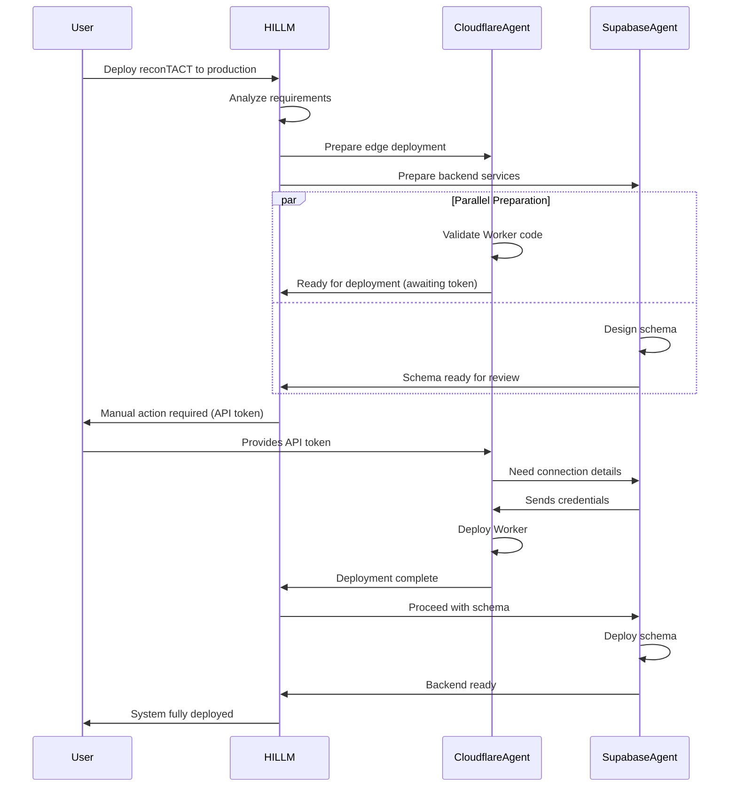

# Agent Collaboration Framework

## Open Dialogue Protocol

### Communication Channels
```typescript
interface AgentCommunication {
  // Direct agent-to-agent messaging
  direct: {
    sender: AgentID;
    recipient: AgentID;
    message: Message;
    urgency: 'LOW' | 'MEDIUM' | 'HIGH' | 'CRITICAL';
    requiresResponse: boolean;
  };
  
  // Broadcast to all agents
  broadcast: {
    sender: AgentID;
    topic: string;
    message: Message;
    relevantAgents: AgentID[];
  };
  
  // HILLM checkpoint request
  checkpointRequest: {
    requestingAgent: AgentID;
    operation: Operation;
    riskAssessment: RiskMatrix;
    alternativeApproaches: Approach[];
  };
}
```

### Collaboration Scenarios

#### Scenario 1: Full Deployment Pipeline


#### Scenario 2: Performance Optimization
```python
# CloudflareAgent detects slow response times
class PerformanceCollaboration:
    async def initiate_optimization(self):
        # CloudflareAgent starts the conversation
        cloudflare_analysis = {
            "issue": "API response time > 500ms",
            "metrics": {
                "p50": "320ms",
                "p95": "580ms", 
                "p99": "1200ms"
            },
            "suspected_cause": "Database query performance"
        }
        
        # Broadcast to relevant agents
        await self.broadcast_to_agents(
            topic="PERFORMANCE_DEGRADATION",
            data=cloudflare_analysis,
            urgency="HIGH"
        )
        
        # SupabaseAgent responds
        supabase_investigation = await supabase_agent.investigate_query_performance()
        
        # Collaborative solution
        optimization_plan = {
            "database": {
                "add_indexes": ["user_id", "created_at"],
                "optimize_query": "Use CTEs instead of subqueries",
                "implement_caching": "Cache frequent queries in KV"
            },
            "edge": {
                "implement_cache": "KV with 5min TTL",
                "add_compression": "Brotli for responses",
                "connection_pooling": "Reuse Supabase clients"
            }
        }
        
        # HILLM review
        hillm_approval = await hillm.review_optimization(optimization_plan)
        
        if hillm_approval.approved:
            await self.execute_optimization(optimization_plan)
        else:
            await self.refine_plan(hillm_approval.feedback)
```

### Real-time Collaboration Interface
```typescript
class AgentCollaborationHub {
  private agents: Map<AgentID, Agent>;
  private hillm: HILLMSupervisor;
  private messageQueue: PriorityQueue<Message>;
  
  async processCollaboration(task: ComplexTask) {
    // 1. HILLM breaks down the task
    const breakdown = await this.hillm.analyzeTask(task);
    
    // 2. Assign subtasks to agents
    const assignments = this.assignSubtasks(breakdown.subtasks);
    
    // 3. Enable real-time communication
    this.enableCrossAgentCommunication();
    
    // 4. Monitor progress
    const monitor = this.createProgressMonitor();
    
    // 5. Handle inter-agent dependencies
    this.setupDependencyResolution();
    
    // 6. Coordinate execution
    const results = await this.coordinateExecution(assignments);
    
    // 7. HILLM final review
    return await this.hillm.reviewCompletedWork(results);
  }
  
  private enableCrossAgentCommunication() {
    this.agents.forEach((agent, id) => {
      agent.on('need_help', async (request) => {
        const helper = this.findBestHelper(request);
        const response = await helper.assist(request);
        agent.receiveHelp(response);
      });
      
      agent.on('discovery', async (finding) => {
        this.broadcast(finding, this.getRelevantAgents(finding));
      });
      
      agent.on('blocked', async (blocker) => {
        const solution = await this.collaborativeSolve(blocker);
        agent.unblock(solution);
      });
    });
  }
}
```

## Tool Integration Matrix

### CloudflareAgent Tools
```yaml
Primary Tools:
  - Bash: Execute wrangler commands
  - Write/Edit: Modify Worker code and configs
  - Read: Analyze deployment files
  - aegnt-27: Browser automation for dashboard

Integrated Tools:
  - mcp__desktop-commander__execute_command: System operations
  - mcp__github__push_files: Version control
  - mcp__puppeteer__screenshot: Visual verification
  - mcp__smithery__generate_tool: Custom tooling
```

### SupabaseAgent Tools
```yaml
Primary Tools:
  - mcp__supabase__*: All Supabase operations
  - Write/Edit: Schema and migration files
  - Bash: Execute supabase CLI commands

Integrated Tools:
  - mcp__notionApi__*: Documentation
  - mcp__quick-data__*: Data analysis
  - mcp__graphiti__add_memory: Knowledge persistence
  - mcp__ai-collaboration-hub__*: AI assistance
```

### HILLM Supervisor Tools
```yaml
Oversight Tools:
  - Read: Review all agent outputs
  - mcp__sequentialthinking__*: Complex analysis
  - mcp__graphiti__search_*: Historical context
  - TodoWrite: Task tracking and delegation

Quality Tools:
  - validate_*: All validation functions
  - mcp__aegnt-27__validate_*: Authenticity checks
  - mcp__quick-data__analyze_*: Data quality
  - mcp__supabase__get_advisors: Security advisories
```

## Persistent Memory Integration

### Knowledge Graph Structure
```typescript
// Using mcp__graphiti for persistent agent memory
const agentMemory = {
  CloudflareAgent: {
    deployments: [], // Historical deployment records
    patterns: [],    // Successful patterns
    failures: [],    // Failed attempts and lessons
    optimizations: [] // Performance improvements
  },
  
  SupabaseAgent: {
    schemas: [],     // Schema evolution history
    migrations: [],  // Migration patterns
    policies: [],    // RLS policy templates
    queries: []      // Optimized query patterns
  },
  
  HILLM: {
    decisions: [],   // Decision history
    overrides: [],   // Manual interventions
    patterns: [],    // Detected anti-patterns
    improvements: [] // System-wide optimizations
  }
};

// Store interaction in knowledge graph
async function recordInteraction(interaction: AgentInteraction) {
  await mcp__graphiti__add_memory({
    name: `Agent Collaboration: ${interaction.type}`,
    episode_body: JSON.stringify({
      timestamp: new Date().toISOString(),
      agents: interaction.participants,
      context: interaction.context,
      decisions: interaction.decisions,
      outcome: interaction.outcome,
      lessons: interaction.lessonsLearned
    }),
    source: 'json',
    group_id: 'agent_collaboration'
  });
}
```

## Conflict Resolution Protocol

### When Agents Disagree
```python
class ConflictResolver:
    def __init__(self, hillm: HILLMSupervisor):
        self.hillm = hillm
        self.resolution_strategies = {
            'performance_vs_security': self.resolve_performance_security,
            'cost_vs_features': self.resolve_cost_features,
            'speed_vs_correctness': self.resolve_speed_correctness,
            'complexity_vs_maintainability': self.resolve_complexity_maintenance
        }
    
    async def resolve_conflict(self, conflict: AgentConflict) -> Resolution:
        # 1. Identify conflict type
        conflict_type = self.categorize_conflict(conflict)
        
        # 2. Gather evidence from both sides
        evidence = {
            agent.id: await agent.present_case()
            for agent in conflict.parties
        }
        
        # 3. HILLM analysis
        analysis = await self.hillm.analyze_conflict(conflict, evidence)
        
        # 4. Apply resolution strategy
        if conflict_type in self.resolution_strategies:
            resolution = await self.resolution_strategies[conflict_type](
                conflict, evidence, analysis
            )
        else:
            # Complex conflict - needs human input
            resolution = await self.escalate_to_human(conflict, evidence)
        
        # 5. Document decision
        await self.document_resolution(conflict, resolution)
        
        return resolution
```

## Active Monitoring Dashboard

### Real-time Agent Status
```typescript
interface AgentDashboard {
  CloudflareAgent: {
    status: 'IDLE' | 'WORKING' | 'BLOCKED' | 'ERROR';
    currentTask: string | null;
    performance: {
      deploymentsToday: number;
      successRate: number;
      avgDeployTime: number;
    };
    blockers: string[];
  };
  
  SupabaseAgent: {
    status: 'IDLE' | 'WORKING' | 'BLOCKED' | 'ERROR';
    currentTask: string | null;
    database: {
      connections: number;
      queryPerformance: number;
      errorRate: number;
    };
    pendingMigrations: number;
  };
  
  HILLM: {
    status: 'MONITORING' | 'REVIEWING' | 'INTERVENING';
    activeReviews: Review[];
    decisionsPending: number;
    alertLevel: 'GREEN' | 'YELLOW' | 'ORANGE' | 'RED';
    concerns: Concern[];
  };
}
```

## Example: Complete Deployment Flow

```typescript
async function deployReconTACT() {
  const deployment = new CollaborativeDeployment();
  
  // 1. HILLM initializes the deployment
  await hillm.initializeDeployment({
    project: 'reconTACT',
    environment: 'production',
    requirements: {
      uptime: '99.9%',
      responseTime: '<200ms',
      security: 'maximum'
    }
  });
  
  // 2. Parallel agent preparation
  const [cloudflareReady, supabaseReady] = await Promise.all([
    cloudflareAgent.prepareDeployment(),
    supabaseAgent.prepareBackend()
  ]);
  
  // 3. Cross-agent configuration
  const config = await deployment.negotiateConfiguration(
    cloudflareReady,
    supabaseReady
  );
  
  // 4. HILLM checkpoint
  const approval = await hillm.reviewDeploymentPlan(config);
  
  if (!approval.approved) {
    // Iterate based on feedback
    return deployment.refineAndRetry(approval.feedback);
  }
  
  // 5. Execute deployment
  const result = await deployment.execute({
    cloudflare: cloudflareAgent,
    supabase: supabaseAgent,
    monitor: hillm
  });
  
  // 6. Verify and document
  await deployment.verify(result);
  await deployment.document(result);
  
  return result;
}
```

## Continuous Learning Loop

```python
class AgentLearningSystem:
    async def post_operation_learning(self, operation: CompletedOperation):
        # 1. Collect metrics
        metrics = await self.collect_metrics(operation)
        
        # 2. Identify improvements
        improvements = await self.analyze_for_improvements(metrics)
        
        # 3. Update agent knowledge
        for improvement in improvements:
            agent = self.get_responsible_agent(improvement)
            await agent.learn(improvement)
        
        # 4. Share across agents
        await self.share_learnings(improvements)
        
        # 5. Update HILLM's standards if needed
        if self.is_significant_learning(improvements):
            await hillm.update_standards(improvements)
```

This collaboration framework ensures that CloudflareAgent and SupabaseAgent work together seamlessly under HILLM's supervision, with open dialogue, shared learning, and continuous improvement.