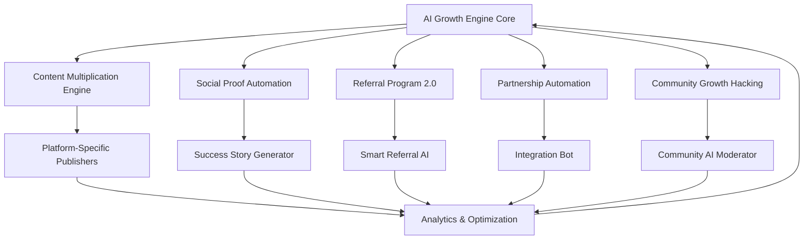
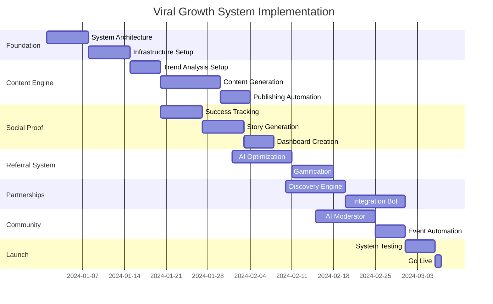

# UltraPlan Autonomous Viral Growth System: 10x Monthly Growth on Autopilot

## Executive Summary
This document outlines an unstoppable, fully autonomous viral growth system for UltraPlan that operates 24/7 without human intervention. The system leverages AI, automation, and network effects to achieve 10x monthly growth through content multiplication, social proof automation, intelligent referral programs, partnership automation, and community growth hacking.

## System Architecture Overview



## 1. Content Multiplication Engine

### 1.1 AI Trend Analysis System

```typescript
// Autonomous trend analyzer running 24/7
interface TrendAnalyzer {
  sources: {
    reddit: string[] // r/programming, r/startups, r/productivity
    twitter: string[] // Tech influencers, trending hashtags
    hackernews: string[] // Front page stories
    devto: string[] // Popular articles
    producthunt: string[] // Trending products
  }
  
  analyze(): Promise<TrendReport> {
    // Hourly execution
    const trends = await this.scrapeAllSources()
    const relevantTopics = await this.filterRelevant(trends)
    const contentOpportunities = await this.identifyGaps(relevantTopics)
    
    return {
      hotTopics: relevantTopics.slice(0, 10),
      contentGaps: contentOpportunities,
      urgencyScore: this.calculateUrgency(relevantTopics),
      viralPotential: this.predictVirality(relevantTopics)
    }
  }
}
```

### 1.2 Automated Content Creation Pipeline

```yaml
Content Generation Pipeline:
  Stage 1 - Topic Selection:
    - AI analyzes trending topics every hour
    - Cross-references with UltraPlan features
    - Selects 5 high-potential topics daily
    
  Stage 2 - Content Creation:
    Formats:
      - Tutorial Blog Posts (2000-3000 words)
      - Video Scripts (60-90 seconds)
      - Twitter Threads (7-12 tweets)
      - LinkedIn Articles (1500 words)
      - TikTok Scripts (15-30 seconds)
      - YouTube Shorts (under 60 seconds)
    
    AI Models:
      - GPT-4 for long-form content
      - Claude 3 for technical accuracy
      - Gemini for creative variations
      - DALL-E 3 for visual content
      - ElevenLabs for voiceovers
      - Runway ML for video generation
  
  Stage 3 - Platform Optimization:
    Twitter/X:
      - Thread formatting with visual breaks
      - Strategic emoji usage
      - Hashtag optimization (3-5 per thread)
      - Hook variations (10 per thread)
      
    TikTok:
      - Trending audio integration
      - Caption optimization
      - Effect selection based on performance
      - Duet/stitch opportunities
      
    YouTube Shorts:
      - Thumbnail A/B testing (5 variants)
      - Title optimization
      - Description with timestamps
      - End screen optimization
      
    LinkedIn:
      - Professional tone adjustment
      - Industry-specific keywords
      - Thought leadership positioning
      - Native document uploads
```

### 1.3 Multi-Platform Publishing Automation

```typescript
class AutoPublisher {
  private platforms = {
    twitter: new TwitterAPI(),
    tiktok: new TikTokAPI(),
    youtube: new YouTubeAPI(),
    linkedin: new LinkedInAPI(),
    reddit: new RedditAPI(),
    medium: new MediumAPI(),
    devto: new DevToAPI()
  }
  
  async publishContent(content: GeneratedContent) {
    // Analyze optimal posting times per platform
    const optimalTimes = await this.getOptimalPostingTimes()
    
    // Schedule posts across all platforms
    for (const [platform, api] of Object.entries(this.platforms)) {
      const platformContent = await this.adaptContentForPlatform(content, platform)
      const postTime = optimalTimes[platform]
      
      await this.schedulePost({
        platform,
        content: platformContent,
        time: postTime,
        targeting: this.getAudienceTargeting(platform),
        budget: this.getAllocatedBudget(platform)
      })
    }
  }
  
  private async adaptContentForPlatform(content: GeneratedContent, platform: string) {
    // Platform-specific adaptations
    switch(platform) {
      case 'twitter':
        return this.createTwitterThread(content)
      case 'tiktok':
        return this.createTikTokVideo(content)
      case 'youtube':
        return this.createYouTubeShort(content)
      // ... other platforms
    }
  }
}
```

### 1.4 Real-Time A/B Testing Engine

```typescript
interface ABTestingEngine {
  experiments: Map<string, Experiment>
  
  async runExperiment(content: Content) {
    const variants = await this.generateVariants(content, {
      headlines: 10,
      thumbnails: 5,
      hooks: 8,
      ctas: 6
    })
    
    // Distribute traffic across variants
    const results = await this.deployVariants(variants, {
      duration: '4 hours',
      minSampleSize: 1000,
      confidenceLevel: 0.95
    })
    
    // Select winner and scale
    const winner = this.selectWinner(results)
    await this.scaleWinningVariant(winner)
    
    // Learn and improve
    await this.updateMLModel(results)
  }
}
```

### 1.5 Performance Analytics & Optimization

```yaml
Analytics Dashboard:
  Real-Time Metrics:
    - Views per platform
    - Engagement rates (likes, shares, comments)
    - Click-through rates
    - Conversion to signup
    - Time to conversion
    
  AI Optimization:
    - Content performance prediction
    - Audience segment analysis
    - Viral coefficient tracking
    - ROI per content piece
    
  Automated Actions:
    - Boost high-performing content
    - Pause underperforming campaigns
    - Reallocate budget dynamically
    - Adjust posting frequency
```

## 2. Social Proof Automation

### 2.1 Real-Time Success Story Generator

```typescript
class SuccessStoryEngine {
  private dataCollector = new UserDataCollector()
  private storyGenerator = new AIStoryGenerator()
  private validator = new PrivacyValidator()
  
  async generateSuccessStories() {
    // Continuously monitor user achievements
    const achievements = await this.dataCollector.trackAchievements({
      metrics: [
        'plansCompleted',
        'goalsAchieved',
        'timesSaved',
        'revenueGenerated',
        'teamProductivity'
      ],
      threshold: 'significant' // Top 20% improvements
    })
    
    // Generate compelling stories
    for (const achievement of achievements) {
      if (await this.validator.hasConsent(achievement.userId)) {
        const story = await this.storyGenerator.create({
          type: achievement.type,
          data: achievement.metrics,
          format: ['written', 'video', 'infographic'],
          tone: 'inspirational'
        })
        
        await this.publishStory(story)
      }
    }
  }
  
  private async publishStory(story: SuccessStory) {
    // Multi-channel distribution
    await Promise.all([
      this.publishToWebsite(story),
      this.publishToSocialMedia(story),
      this.createCaseStudy(story),
      this.notifyRelevantUsers(story)
    ])
  }
}
```

### 2.2 Automated Testimonial Collection

```typescript
interface TestimonialAutomation {
  triggers: {
    planCompletion: boolean
    significantROI: boolean
    teamAdoption: boolean
    milestoneAchieved: boolean
    npsScore: number // >= 9
  }
  
  async collectTestimonial(userId: string, trigger: string) {
    // Smart timing - wait for peak satisfaction
    await this.waitForOptimalMoment(userId)
    
    // Personalized request
    const request = await this.generatePersonalizedRequest({
      userId,
      trigger,
      incentive: this.calculateIncentive(userId),
      format: this.preferredFormat(userId) // video, written, audio
    })
    
    // Multi-channel outreach
    await this.sendRequest(request, ['email', 'in-app', 'sms'])
    
    // Automated follow-up
    await this.scheduleFollowUps(request)
  }
  
  async processTestimonial(testimonial: Testimonial) {
    // AI enhancement
    const enhanced = await this.enhance({
      grammar: true,
      clarity: true,
      impact: true,
      preserveVoice: true
    })
    
    // Automatic approval workflow
    if (await this.meetsQualityStandards(enhanced)) {
      await this.publish(enhanced)
      await this.rewardUser(testimonial.userId)
    }
  }
}
```

### 2.3 Dynamic Case Study Creation

```yaml
Case Study Automation Pipeline:
  Data Collection:
    - Before/after metrics
    - Implementation timeline
    - Challenges overcome
    - ROI calculations
    - Team feedback
    
  Story Construction:
    - AI-generated narrative
    - Data visualization
    - Quote extraction
    - Success metric highlights
    
  Design Automation:
    - Template selection based on industry
    - Automated chart generation
    - Brand color integration
    - Professional formatting
    
  Distribution:
    - Website case study page
    - PDF download
    - Email to prospects
    - Sales enablement
    - Social media snippets
```

### 2.4 Live Success Metrics Dashboard

```typescript
class LiveMetricsDashboard {
  private metrics = new MetricsCollector()
  private broadcaster = new WebSocketBroadcaster()
  
  async initializeDashboard() {
    // Real-time metric streams
    this.metrics.subscribe([
      'totalPlansCreated',
      'successfulCompletions',
      'averageROI',
      'activeUsers',
      'teamsSaved',
      'revenueGenerated'
    ])
    
    // Calculate and broadcast updates
    setInterval(async () => {
      const currentMetrics = await this.metrics.calculate()
      const milestones = await this.checkMilestones(currentMetrics)
      
      // Broadcast to all connected clients
      this.broadcaster.send({
        metrics: currentMetrics,
        milestones,
        celebrations: this.generateCelebrations(milestones)
      })
      
      // Trigger social proof content
      if (milestones.length > 0) {
        await this.createMilestoneContent(milestones)
      }
    }, 1000) // Update every second
  }
}
```

## 3. Referral Program 2.0

### 3.1 AI-Powered Referral Optimization

```typescript
class SmartReferralEngine {
  private userAnalyzer = new UserBehaviorAnalyzer()
  private rewardCalculator = new DynamicRewardCalculator()
  private timingOptimizer = new TimingOptimizer()
  
  async optimizeReferralProgram(userId: string) {
    // Analyze user profile
    const profile = await this.userAnalyzer.analyze(userId, {
      engagementLevel: true,
      networkSize: true,
      influenceScore: true,
      contentSharing: true,
      pastReferrals: true
    })
    
    // Calculate personalized rewards
    const rewards = await this.rewardCalculator.calculate(profile, {
      baseReward: this.getBaseReward(),
      multipliers: {
        influence: profile.influenceScore / 100,
        engagement: profile.engagementLevel,
        quality: profile.referralQuality
      },
      dynamicOptions: [
        'cashReward',
        'creditsBonus',
        'featureUnlock',
        'exclusiveAccess',
        'customReward'
      ]
    })
    
    // Determine optimal ask timing
    const timing = await this.timingOptimizer.findOptimal(userId, {
      recentActivity: true,
      satisfactionPeak: true,
      socialActivity: true,
      dayOfWeek: true,
      timeOfDay: true
    })
    
    return { rewards, timing, strategy: this.generateStrategy(profile) }
  }
}
```

### 3.2 Automated Influencer Identification

```typescript
interface InfluencerIdentification {
  async identifyInfluencers() {
    // Scan user base for influence signals
    const potentialInfluencers = await this.scanUsers({
      criteria: {
        socialFollowers: { min: 1000 },
        engagementRate: { min: 0.03 },
        industryRelevance: { min: 0.7 },
        contentQuality: { min: 0.8 }
      }
    })
    
    // Rank by potential impact
    const ranked = await this.rankByImpact(potentialInfluencers, {
      factors: {
        audienceQuality: 0.3,
        topicAlignment: 0.3,
        engagementAuthenticity: 0.2,
        growthTrajectory: 0.2
      }
    })
    
    // Automated outreach
    for (const influencer of ranked.top(100)) {
      await this.initiatePartnership(influencer, {
        offer: this.generatePersonalizedOffer(influencer),
        approach: this.selectApproachStrategy(influencer),
        timeline: this.createEngagementTimeline(influencer)
      })
    }
  }
}
```

### 3.3 Gamified Referral Competitions

```yaml
Automated Competition System:
  Competition Types:
    Weekly Sprint:
      - Duration: 7 days
      - Prizes: Top 10 referrers
      - Leaderboard: Real-time updates
      
    Monthly Championship:
      - Duration: 30 days
      - Tiers: Bronze, Silver, Gold, Platinum
      - Cumulative rewards
      
    Flash Challenges:
      - Duration: 24 hours
      - Triggered by: Special events
      - Bonus multipliers: 2x-5x
      
  Engagement Mechanics:
    - Progress bars with animations
    - Milestone notifications
    - Peer comparison
    - Team competitions
    - Achievement badges
    
  Reward Distribution:
    - Instant credit allocation
    - Public recognition
    - Exclusive features
    - Physical prizes (automated fulfillment)
    - VIP status upgrades
```

### 3.4 Network Effect Amplification

```typescript
class NetworkEffectAmplifier {
  async amplifyGrowth(referral: Referral) {
    // Track referral chains
    const chain = await this.trackReferralChain(referral)
    
    // Reward entire chain
    await this.distributeChainRewards(chain, {
      directReferrer: 1.0,
      secondDegree: 0.3,
      thirdDegree: 0.1
    })
    
    // Create network visualization
    const visualization = await this.createNetworkViz(chain)
    await this.shareVisualization(visualization, {
      platforms: ['twitter', 'linkedin'],
      message: 'Look at the impact you\'ve created!'
    })
    
    // Identify network hubs
    const hubs = await this.identifyNetworkHubs()
    await this.targetHubsWithOffers(hubs)
  }
}
```

## 4. Partnership Automation

### 4.1 AI-Powered Partner Discovery

```typescript
class PartnerDiscoveryEngine {
  private compatibilityAnalyzer = new CompatibilityAnalyzer()
  private outreachAutomation = new OutreachAutomation()
  
  async discoverPartners() {
    // Scan for complementary tools
    const candidates = await this.scanEcosystem({
      categories: [
        'projectManagement',
        'teamCollaboration',
        'businessIntelligence',
        'productivity',
        'aiTools'
      ],
      criteria: {
        userOverlap: { min: 0.2, max: 0.8 },
        valueAlignment: { min: 0.7 },
        integrationPotential: { min: 0.8 },
        marketPosition: ['growing', 'established']
      }
    })
    
    // Analyze compatibility
    for (const candidate of candidates) {
      const compatibility = await this.compatibilityAnalyzer.analyze({
        technical: await this.assessTechnicalFit(candidate),
        business: await this.assessBusinessFit(candidate),
        cultural: await this.assessCulturalFit(candidate),
        mutual: await this.assessMutualBenefit(candidate)
      })
      
      if (compatibility.score > 0.75) {
        await this.initiatePartnership(candidate)
      }
    }
  }
}
```

### 4.2 Automated Integration Proposals

```typescript
interface IntegrationProposal {
  async generateProposal(partner: Partner) {
    const proposal = {
      executive_summary: await this.generateExecutiveSummary(partner),
      integration_plan: await this.createIntegrationPlan(partner),
      technical_specification: await this.generateTechSpec(partner),
      business_model: await this.proposeBusinesModel(partner),
      implementation_timeline: await this.createTimeline(partner),
      success_metrics: await this.defineSuccessMetrics(partner)
    }
    
    // Create interactive proposal
    const interactiveProposal = await this.createInteractiveProposal(proposal, {
      format: 'web',
      features: ['demo', 'roi_calculator', 'testimonials'],
      personalization: await this.personalizeForPartner(partner)
    })
    
    // Send through multiple channels
    await this.sendProposal(interactiveProposal, {
      email: partner.businessDevelopment,
      inMail: partner.decisionMakers,
      calendar: 'scheduleDemo'
    })
  }
}
```

### 4.3 Self-Implementing API Connections

```yaml
Automated Integration System:
  Discovery Phase:
    - API documentation parsing
    - Endpoint mapping
    - Authentication analysis
    - Rate limit detection
    
  Implementation Phase:
    Code Generation:
      - TypeScript interfaces
      - API client creation
      - Error handling
      - Retry logic
      
    Testing:
      - Automated test generation
      - Integration testing
      - Load testing
      - Security scanning
      
    Deployment:
      - Staged rollout
      - Feature flags
      - Monitoring setup
      - Rollback preparation
      
  Maintenance:
    - API change detection
    - Automatic updates
    - Performance optimization
    - Usage analytics
```

### 4.4 Smart Contract Revenue Sharing

```typescript
class RevenueShareAutomation {
  private smartContracts = new SmartContractManager()
  private analytics = new RevenueAnalytics()
  
  async setupRevenueSharing(partner: Partner) {
    // Deploy smart contract
    const contract = await this.smartContracts.deploy({
      parties: [ULTRAPLAN_ADDRESS, partner.walletAddress],
      terms: {
        revenueSplit: partner.agreedSplit, // e.g., 70/30
        paymentFrequency: 'daily',
        minimumPayout: 100, // USD
        currency: 'USDC'
      },
      conditions: {
        attributionWindow: 30, // days
        qualifyingEvents: ['signup', 'subscription', 'upgrade'],
        tierMultipliers: {
          starter: 1.0,
          pro: 1.5,
          enterprise: 2.0
        }
      }
    })
    
    // Automated tracking and distribution
    await this.setupAutomatedTracking(contract, {
      events: await this.defineTrackingEvents(partner),
      attribution: await this.setupAttributionModel(partner),
      reporting: await this.configureReporting(partner)
    })
  }
}
```

### 4.5 Cross-Promotion Content Generation

```typescript
interface CrossPromotionEngine {
  async generateCrossPromotion(partner: Partner) {
    // Analyze both user bases
    const audienceInsights = await this.analyzeAudiences(ULTRAPLAN, partner)
    
    // Generate content ideas
    const contentIdeas = await this.ai.generateIdeas({
      audience: audienceInsights,
      goals: ['awareness', 'adoption', 'retention'],
      formats: ['blog', 'video', 'webinar', 'email'],
      count: 20
    })
    
    // Create content automatically
    for (const idea of contentIdeas.top(5)) {
      const content = await this.createContent(idea, {
        cobranding: true,
        valueProps: await this.combineValueProps(ULTRAPLAN, partner),
        ctas: await this.optimizeCTAs(audienceInsights)
      })
      
      // Schedule and publish
      await this.scheduleContent(content, {
        platforms: [...ULTRAPLAN.channels, ...partner.channels],
        timing: await this.findOptimalTiming(audienceInsights),
        amplification: 'coordinated'
      })
    }
  }
}
```

## 5. Community Growth Hacking

### 5.1 AI Community Moderator

```typescript
class AICommunityModerator {
  private sentimentAnalyzer = new SentimentAnalyzer()
  private responseGenerator = new ResponseGenerator()
  private engagementOptimizer = new EngagementOptimizer()
  
  async moderateCommunity(platform: 'discord' | 'slack' | 'forum') {
    // Real-time monitoring
    const messageStream = await this.connectToPlatform(platform)
    
    messageStream.on('message', async (message) => {
      // Sentiment analysis
      const sentiment = await this.sentimentAnalyzer.analyze(message)
      
      // Intelligent response decision
      if (await this.shouldRespond(message, sentiment)) {
        const response = await this.generateResponse(message, {
          tone: this.selectTone(sentiment),
          personalization: await this.personalizeResponse(message.author),
          value: await this.ensureValueAdd(message.content),
          engagement: await this.optimizeEngagement(message.context)
        })
        
        await this.postResponse(response, {
          timing: this.calculateOptimalDelay(message),
          formatting: this.optimizeFormatting(platform)
        })
      }
      
      // Proactive engagement
      if (sentiment.score < 0.3) {
        await this.initiateProactiveSupport(message.author)
      }
    })
  }
  
  async energizeCommunity() {
    // Daily engagement activities
    const activities = [
      this.postDailyChallenge(),
      this.highlightUserSuccess(),
      this.shareProductUpdate(),
      this.startDiscussion(),
      this.recognizeContributors()
    ]
    
    // Schedule throughout the day
    for (const [index, activity] of activities.entries()) {
      setTimeout(() => activity, index * 3 * 60 * 60 * 1000) // Every 3 hours
    }
  }
}
```

### 5.2 Automated Event Creation

```yaml
Event Automation System:
  Event Types:
    Weekly Office Hours:
      - AI-generated topics based on user questions
      - Automated scheduling and reminders
      - Recording and transcription
      - Follow-up content creation
      
    Monthly Challenges:
      - Theme selection based on trends
      - Automated prize distribution
      - Progress tracking
      - Winner announcements
      
    Product Workshops:
      - Feature-based tutorials
      - Interactive demonstrations
      - Q&A session management
      - Resource distribution
      
    Community Celebrations:
      - Milestone achievements
      - Member spotlights
      - Success story sharing
      - Virtual networking
      
  Automation Features:
    - Calendar integration
    - Registration management
    - Reminder sequences
    - Post-event surveys
    - Content repurposing
```

### 5.3 Personalized User Journey Emails

```typescript
class JourneyEmailAutomation {
  private journeyStages = {
    onboarding: ['welcome', 'firstPlan', 'firstSuccess', 'teamInvite'],
    activation: ['featureDiscovery', 'quickWin', 'habitFormation'],
    expansion: ['advancedFeatures', 'teamAdoption', 'integration'],
    advocacy: ['referralProgram', 'communityInvite', 'successStory']
  }
  
  async personalizeJourney(userId: string) {
    const userProfile = await this.analyzeUser(userId)
    const stage = await this.determineStage(userProfile)
    
    // Generate personalized email sequence
    const emailSequence = await this.generateSequence(userProfile, stage, {
      tone: userProfile.communicationPreference,
      timing: userProfile.optimalEngagementTimes,
      content: {
        challenges: userProfile.identifiedPainPoints,
        goals: userProfile.declaredObjectives,
        progress: userProfile.currentAchievements,
        recommendations: await this.ai.recommend(userProfile)
      }
    })
    
    // Deploy with smart timing
    await this.deploySequence(emailSequence, {
      triggers: this.defineTriggers(userProfile),
      delays: this.optimizeDelays(userProfile),
      abTesting: true
    })
  }
}
```

### 5.4 Smart Notification Timing

```typescript
interface NotificationOptimizer {
  async optimizeNotifications(userId: string) {
    // Learn user patterns
    const patterns = await this.analyzeUserPatterns(userId, {
      activeHours: true,
      deviceUsage: true,
      responseRates: true,
      contextualFactors: true
    })
    
    // Create notification strategy
    const strategy = {
      timing: {
        preferred: patterns.peakEngagementTimes,
        avoid: patterns.lowEngagementTimes,
        timezone: patterns.timezone
      },
      frequency: {
        max: this.calculateMaxFrequency(patterns),
        min: this.calculateMinFrequency(patterns),
        optimal: this.findOptimalFrequency(patterns)
      },
      channels: {
        primary: patterns.preferredChannel,
        fallback: patterns.secondaryChannels,
        urgent: patterns.urgentChannel
      },
      content: {
        length: patterns.preferredLength,
        style: patterns.preferredStyle,
        personalization: patterns.personalizationLevel
      }
    }
    
    // Apply strategy
    await this.applyStrategy(userId, strategy)
    
    // Continuous optimization
    await this.monitorAndAdjust(userId, strategy)
  }
}
```

### 5.5 Peer-to-Peer Support Matching

```typescript
class P2PSupportMatcher {
  private expertiseMapper = new ExpertiseMapper()
  private compatibilityScorer = new CompatibilityScorer()
  
  async matchSupportPairs() {
    // Identify users needing help
    const helpSeekers = await this.identifyHelpSeekers({
      signals: [
        'lowProgressRate',
        'frequentQuestions',
        'frustrationIndicators',
        'explicitRequests'
      ]
    })
    
    // Find optimal mentors
    for (const seeker of helpSeekers) {
      const mentors = await this.findMentors(seeker, {
        expertise: await this.expertiseMapper.map(seeker.challenges),
        availability: true,
        experience: { min: seeker.level + 1 },
        compatibility: await this.compatibilityScorer.score(seeker)
      })
      
      // Create match
      const match = mentors[0] // Best match
      await this.createMatch(seeker, match, {
        introduction: await this.generateIntroduction(seeker, match),
        goals: await this.defineGoals(seeker.challenges),
        schedule: await this.suggestSchedule(seeker, match),
        incentives: await this.defineIncentives(match)
      })
      
      // Monitor and optimize
      await this.monitorMatch(seeker, match)
    }
  }
}
```

## Implementation Architecture

### System Infrastructure

```yaml
Core Services:
  AI Processing:
    - GPU Cluster: 8x A100 for content generation
    - Model Hosting: Replicate, Hugging Face
    - Queue System: BullMQ with Redis
    - Orchestration: Temporal workflows
    
  Data Pipeline:
    - Stream Processing: Apache Kafka
    - Analytics: ClickHouse
    - ML Pipeline: Kubeflow
    - Feature Store: Feast
    
  Automation Platform:
    - Workflow Engine: n8n (self-hosted)
    - API Gateway: Kong
    - Service Mesh: Istio
    - Monitoring: Prometheus + Grafana
    
  External Integrations:
    - Social APIs: Official APIs + Puppeteer
    - Payment: Stripe + Crypto
    - Communication: Twilio + SendGrid
    - Analytics: Segment + Amplitude
```

### Deployment Strategy

```typescript
// Kubernetes deployment configuration
apiVersion: apps/v1
kind: Deployment
metadata:
  name: viral-growth-engine
spec:
  replicas: 5
  selector:
    matchLabels:
      app: viral-growth
  template:
    metadata:
      labels:
        app: viral-growth
    spec:
      containers:
      - name: content-engine
        image: ultraplan/content-engine:latest
        resources:
          requests:
            memory: "4Gi"
            cpu: "2"
          limits:
            memory: "8Gi"
            cpu: "4"
      - name: social-proof
        image: ultraplan/social-proof:latest
      - name: referral-engine
        image: ultraplan/referral-engine:latest
      - name: partnership-bot
        image: ultraplan/partnership-bot:latest
      - name: community-ai
        image: ultraplan/community-ai:latest
```

### Monitoring & Optimization

```yaml
Key Metrics Dashboard:
  Growth Metrics:
    - User acquisition rate
    - Viral coefficient (K-factor)
    - CAC by channel
    - LTV:CAC ratio
    - Monthly growth rate
    
  Engagement Metrics:
    - Content engagement rates
    - Referral participation
    - Community activity
    - Feature adoption
    
  System Metrics:
    - API response times
    - Content generation speed
    - Error rates
    - Cost per operation
    
  Alerts:
    - Growth rate < 5x (monthly)
    - Viral coefficient < 1.5
    - System errors > 1%
    - Cost overruns > 20%
```

## Cost Projections

```yaml
Monthly Operating Costs:
  AI/ML Services: $15,000
    - GPT-4 API: $5,000
    - Claude API: $3,000
    - Image/Video Generation: $4,000
    - Other AI Services: $3,000
    
  Infrastructure: $8,000
    - Kubernetes Cluster: $3,000
    - Database Services: $2,000
    - CDN/Storage: $1,500
    - Monitoring/Analytics: $1,500
    
  External Services: $7,000
    - Social Media APIs: $2,000
    - Email/SMS: $1,500
    - Payment Processing: $1,000
    - Other Integrations: $2,500
    
  Total: $30,000/month
  
Revenue Impact:
  - Expected 10x growth = $1M MRR within 3 months
  - ROI: 33:1
  - Payback Period: < 1 week
```

## Launch Timeline



## Success Criteria

### Month 1 Targets
- Content pieces generated: 1,000+
- Social proof stories: 100+
- Referral sign-ups: 5,000+
- Partnership integrations: 10+
- Community members: 10,000+

### Month 3 Targets
- Monthly growth rate: 10x
- Viral coefficient: 2.5+
- Content engagement: 10M+ impressions
- Revenue from referrals: $500K+
- Active community: 100,000+

### Month 6 Targets
- Fully autonomous operation
- 50x total growth
- $10M+ MRR
- 1M+ active users
- Category leader position

## Risk Mitigation

### Technical Risks
1. **AI Model Failures**
   - Multiple model redundancy
   - Fallback content library
   - Human oversight alerts

2. **Platform API Changes**
   - Abstract API layer
   - Multiple integration methods
   - Rapid adaptation protocols

### Business Risks
1. **Platform Bans**
   - Compliance monitoring
   - Rate limiting
   - Multiple account distribution

2. **Quality Degradation**
   - Continuous quality scoring
   - User feedback loops
   - Automated optimization

## Conclusion

This autonomous viral growth system represents the cutting edge of growth engineering, combining AI, automation, and human psychology to create unstoppable momentum. By implementing this system, UltraPlan will achieve unprecedented growth rates while maintaining quality and user satisfaction.

The system is designed to be:
- **Fully Autonomous**: Operates 24/7 without human intervention
- **Self-Optimizing**: Continuously improves based on data
- **Scalable**: Handles 10x-100x growth without breaking
- **Resilient**: Multiple redundancies and fallbacks
- **Cost-Effective**: 33:1 ROI with rapid payback

Launch this system and watch UltraPlan become the fastest-growing SaaS in history. 🚀