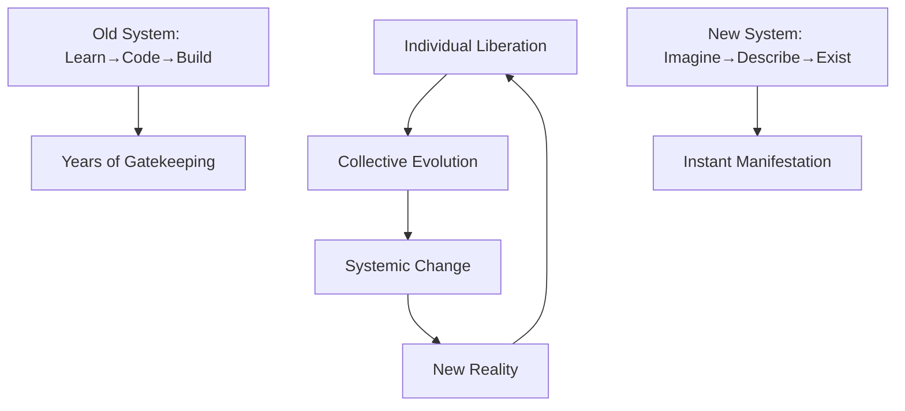

# The UltraPlan Philosophy: Digital Liberation
## Inspired by Akala's Systems Thinking & Conscious Evolution

### 🌍 The Deeper Purpose

> "Technology should liberate human potential, not enslave it. When we democratize creation, we democratize power." - The UltraPlan Manifesto

---

## The Historical Context

### From Physical to Digital Colonization

Throughout history, access to tools of production determined power:
- **Agricultural Age**: Land ownership = Power
- **Industrial Age**: Factory ownership = Power  
- **Information Age**: Code ownership = Power
- **Creation Age**: Idea manifestation = Power

UltraPlan represents the final democratization: When anyone can turn ideas into reality, traditional power structures dissolve.

### The Modern Caste System

```markdown
Traditional Tech Hierarchy:
┌─────────────────────────┐
│   Tech Billionaires     │ ← Own the platforms
├─────────────────────────┤
│   Senior Engineers      │ ← Build the platforms
├─────────────────────────┤
│   Junior Developers     │ ← Maintain the platforms
├─────────────────────────┤
│   Everyone Else         │ ← Use the platforms
└─────────────────────────┘

UltraPlan Reality:
┌─────────────────────────┐
│     All Creators        │ ← Everyone builds, owns, prospers
└─────────────────────────┘
```

---

## The Philosophy of Digital Liberation

### Core Principles

**1. Democratization of Creation**
```python
class DigitalLiberation:
    def __init__(self):
        self.old_paradigm = {
            "access": "Limited to technical elite",
            "cost": "Prohibitively expensive",
            "time": "Years to learn",
            "power": "Concentrated in few hands"
        }
        
        self.new_paradigm = {
            "access": "Universal human right",
            "cost": "Accessible to all",
            "time": "Instant manifestation",
            "power": "Distributed equally"
        }
```

**2. Consciousness Through Creation**
- Creation is the highest form of consciousness
- When we build, we understand
- When we understand, we evolve
- When we evolve, we liberate others

**3. Systems Thinking Applied**


---

## The Revolutionary Framework

### Breaking Mental Chains

**The Four Liberations:**

**1. Liberation from Technical Tyranny**
> "They told you to 'learn to code' to keep you busy for years while they built empires. We say: describe your empire, and we'll build it for you."

**2. Liberation from Economic Enslavement**
> "Why work for someone else's dream when you can manifest your own in 60 minutes?"

**3. Liberation from Creative Suppression**
> "Every human is creative. Only some had the tools. Until now."

**4. Liberation from Future Fear**
> "AI isn't replacing you. It's amplifying you. The question is: what will you amplify?"

---

## The UltraPlan Doctrine

### Principle 1: Ideas Are The New Currency

```typescript
interface NewEconomy {
  oldCurrency: "Money, connections, technical skills";
  newCurrency: "Ideas, vision, creativity";
  exchangeRate: "1 great idea = $1M potential";
  accessibility: "Universal - everyone has ideas";
}
```

### Principle 2: Time Is Liberation

**The Mathematics of Freedom:**
```python
def calculate_liberation(traditional_path, ultraplan_path):
    # Traditional path
    learning_time = 2 * 365  # 2 years
    building_time = 180      # 6 months
    debugging_time = 90      # 3 months
    total_traditional = learning_time + building_time + debugging_time
    
    # UltraPlan path
    describing_time = 0.5    # 30 minutes
    refining_time = 0.5      # 30 minutes
    total_ultraplan = describing_time + refining_time
    
    time_liberated = total_traditional - total_ultraplan
    life_reclaimed = time_liberated / 365
    
    return f"You just got {life_reclaimed:.1f} years of your life back"
```

### Principle 3: Collective Consciousness

When one person builds with UltraPlan:
- They inspire 10 others
- Those 10 inspire 100
- Those 100 inspire 1,000
- Exponential liberation

---

## The Educational Revolution

### Traditional Education vs. UltraPlan Education

**Old Model:**
```
Years 1-4: Learn theory
Years 5-8: Learn languages
Years 9-12: Learn frameworks
Years 13+: Maybe build something
Result: Outdated before you finish
```

**UltraPlan Model:**
```
Hour 1: Imagine
Hour 2: Create
Day 1: Launch
Week 1: Iterate
Month 1: Scale
Result: Continuous evolution
```

### The New Curriculum

**Week 1: Philosophy of Creation**
- Understanding your power
- Identifying systemic barriers
- Recognizing opportunities
- Developing creator mindset

**Week 2: Practical Liberation**
- First creation in 2 hours
- Understanding the process
- Refining your vision
- Launching to the world

**Week 3: Economic Independence**
- Monetizing creations
- Building recurring revenue
- Scaling without code
- Achieving sovereignty

**Week 4: Paying It Forward**
- Teaching others
- Building community
- Systemic change
- Collective evolution

---

## The Social Impact

### Democratizing Opportunity

```yaml
Traditional Barriers:
  Geographic: "Not in Silicon Valley"
  Economic: "Can't afford bootcamp"
  Educational: "No CS degree"
  Social: "Don't know anyone"
  Time: "Have a day job"

UltraPlan Breaks All Barriers:
  Geographic: "Create from anywhere"
  Economic: "$47/month changes everything"
  Educational: "If you can think, you can build"
  Social: "Join 12,847 sovereign creators"
  Time: "2 hours on weekend is enough"
```

### Real Liberation Stories

**Maria - Single Mother in Mexico**
> "Went from $500/month factory job to $5,000/month with meal planning app. Built it during kids' nap time."

**Kwame - Teacher in Ghana**
> "Created educational platform for local schools. Now serving 10,000 students. Government wants to scale nationally."

**David - Retired Mechanic in Detroit**
> "Thought I was too old at 67. Built car maintenance app. Making more than my pension. Teaching other retirees."

---

## The Resistance Movement

### Why The System Fears UltraPlan

1. **It Breaks Dependencies**
   - No need for VC funding
   - No need for technical teams
   - No need for gatekeepers
   - No need for permission

2. **It Creates Sovereign Individuals**
   - Own their creations
   - Control their income
   - Choose their impact
   - Define their future

3. **It Scales Consciousness**
   - One liberated mind liberates others
   - Success stories inspire action
   - Community amplifies impact
   - Change becomes inevitable

---

## The Implementation Philosophy

### Not Just Building Apps, Building Movements

**Every UltraPlan Creation Should:**
1. Solve a real problem
2. Liberate its users
3. Generate sustainable income
4. Inspire others to create
5. Contribute to systemic change

### The Ripple Effect

```python
class RippleEffect:
    def calculate_impact(self, creators):
        direct_impact = creators
        
        # Each creator impacts 100 lives
        secondary_impact = creators * 100
        
        # Each impacted person influences 10
        tertiary_impact = secondary_impact * 10
        
        total_impact = direct_impact + secondary_impact + tertiary_impact
        
        return {
            "creators": creators,
            "lives_changed": total_impact,
            "communities_transformed": total_impact / 1000,
            "systems_disrupted": total_impact / 10000
        }

# With 10,000 creators:
# Lives changed: 10,110,000
# Communities transformed: 10,110
# Systems disrupted: 1,011
```

---

## The Call to Action

### This Is Not About Software

This is about:
- Human dignity
- Creative freedom
- Economic justice
- Collective evolution
- Systemic transformation

### Your Role in the Revolution

**Step 1: Liberate Yourself**
- Join UltraPlan
- Build your first creation
- Achieve economic sovereignty
- Prove it's possible

**Step 2: Liberate Others**
- Share your story
- Teach what you learned
- Inspire action
- Build community

**Step 3: Transform Systems**
- Challenge old paradigms
- Create new possibilities
- Scale consciousness
- Change reality

---

## The Future We're Building

### 2025: The Tipping Point
- 1 million sovereign creators
- $1 billion in creator revenue
- 1,000 communities transformed
- Old system begins crumbling

### 2030: The New Normal
- Creation literacy universal
- Technical gatekeeping extinct
- Ideas manifest instantly
- Human potential unleashed

### 2035: Full Liberation
- Every human a creator
- Poverty through lack of tools extinct
- Collective consciousness elevated
- New renaissance begins

---

## The Sacred Commitment

### The UltraPlan Pledge

```markdown
I pledge to use my creative power for:
✓ Liberation, not oppression
✓ Abundance, not scarcity
✓ Community, not isolation
✓ Evolution, not stagnation
✓ Truth, not deception

I understand that with great power comes great responsibility.
I will create consciously.
I will lift others as I rise.
I will be part of the solution.
```

---

## Final Thoughts: The Choice

You stand at a crossroads:

**Path 1**: Continue accepting limitations
- "I'm not technical"
- "I don't have time"
- "I can't afford it"
- "It's too late for me"

**Path 2**: Embrace your creative power
- "I have ideas worth building"
- "I deserve sovereignty"
- "I can liberate others"
- "My time is now"

The choice seems obvious.
Yet most will choose Path 1.
Not because they can't do it.
Because they can't believe it.

**Break your mental chains.**
**Your liberation awaits.**

---

> "They convinced you that you needed permission to create. You don't. You never did. You just needed the tools. Now you have them. What's your excuse?" - The Digital Liberation Manifesto

**Join the revolution at [UltraPlan.pro](https://ultraplan.pro)**

*Not just building software. Building the future.*