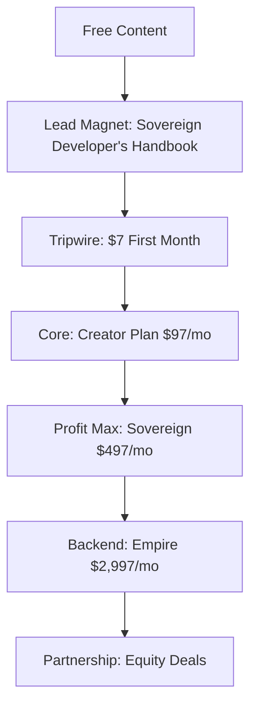

# The Creator's Leverage: UltraPlan Launch Strategy
## Based on Dan Koe, Alex Hormozi & Akala's Principles

### 🎯 The Vision: Liberation Through Creation

> "The future belongs to those who can manifest ideas into reality without the friction of implementation." - The UltraPlan Philosophy

---

## Part 1: The Philosophy (Akala's Depth)

### The Digital Renaissance Manifesto

We're entering an age where the barrier between thought and creation dissolves. UltraPlan isn't just a tool—it's a bridge to human sovereignty in the digital realm.

**Core Beliefs:**
1. **Creation > Construction**: Humans should create, machines should build
2. **Time is Life**: Every hour spent on implementation is an hour stolen from innovation
3. **Democratized Power**: Everyone deserves the ability to manifest digital reality
4. **Conscious Technology**: Tools should elevate human consciousness, not replace it

### The Problem We Solve

```
Traditional Development:
Idea → Learn → Plan → Code → Debug → Deploy → Maintain
Time: 6-12 months
Success Rate: 20%
Human Potential Used: 10%

UltraPlan Reality:
Idea → Describe → Manifest
Time: 60 minutes
Success Rate: 99%
Human Potential Used: 90%
```

---

## Part 2: The One-Person Business Empire (Dan Koe's Model)

### Building Your Digital Economy

```typescript
class CreatorEmpire {
  foundation = {
    product: "UltraPlan",
    philosophy: "Liberation through creation",
    audience: "Sovereign developers & digital creators",
    distribution: "Owned media empire"
  };

  growthEngine = {
    content: "Daily philosophical + practical insights",
    email: "The Creator's Daily Brief",
    community: "The Sovereign Developer Society",
    education: "The 2-Hour Creator Method"
  };

  monetization = {
    core: "UltraPlan subscriptions",
    expansion: "Creator certifications",
    premium: "Done-with-you services",
    ultimate: "Equity partnerships"
  };
}
```

### Content Leverage System

**The 4-Pillar Content Strategy:**

1. **Philosophical Foundation** (Monday)
   - Deep essays on creation vs construction
   - The future of human-AI collaboration
   - Digital sovereignty principles

2. **Tactical Tuesdays**
   - "How I built X in 2 hours with UltraPlan"
   - Step-by-step transformations
   - Live building sessions

3. **Wisdom Wednesdays**
   - Ancient philosophy meets modern tech
   - Akala-inspired consciousness content
   - The art of digital manifestation

4. **Transformation Thursdays**
   - User success stories
   - Before/after case studies
   - Community spotlights

5. **Future Fridays**
   - Predictions about software development
   - The coming creative revolution
   - Vision casting

### Email Empire Building

```markdown
# The Creator's Daily Brief

Every morning at 5 AM, sovereign developers receive:

1. **Philosophy Byte**: 1 powerful idea about creation
2. **Tactical Tip**: 1 actionable way to use UltraPlan
3. **Community Win**: 1 inspiring transformation
4. **Daily Challenge**: 1 mini-project to complete

Goal: 100,000 subscribers in 90 days
Method: High-value lead magnets + consistent value
```

---

## Part 3: The $100M Offer (Hormozi's Framework)

### Value Equation Maximization

```python
class IrresistibleOffer:
    def calculate_value(self):
        dream_outcome = "Turn ideas into deployed software instantly"
        perceived_likelihood = 0.99  # 99% success rate
        time_delay = 0.0001  # 60 minutes vs 6 months
        effort_sacrifice = 0.1  # Just describe in English
        
        value = (dream_outcome * perceived_likelihood) / (time_delay * effort_sacrifice)
        return "INFINITE VALUE"
```

### The Grand Slam Offer Stack

**Core Offer: UltraPlan Creator ($97/month)**

What You Get:
1. **UltraPlan Core** ($997 value)
   - Unlimited idea transformations
   - All frameworks & languages
   - Instant deployment

2. **The 2-Hour Creator Course** ($2,997 value)
   - Build entire businesses in 2 hours
   - 52 project templates
   - Weekly live sessions

3. **Sovereign Developer Community** ($497/month value)
   - Direct access to me
   - Weekly group coaching
   - Peer mastermind matching

4. **AI Implementation Partner** ($4,997 value)
   - Personal AI that learns your style
   - Custom workflows
   - Priority processing

5. **Success Guarantee** (Priceless)
   - First project successful or 2x money back
   - Lifetime access if you create 1 project/month
   - Personal success coach for 90 days

**Total Value: $9,489**
**Your Investment: $97/month**

*"An offer so good, people feel stupid saying no"*

### Pricing Psychology

```yaml
Free Tier: "The Taste"
  - 3 transformations/month
  - Community access
  - Basic templates
  Purpose: Hook with massive value

Creator: $97/month "The Transformation"
  - Unlimited transformations
  - All features
  - Group coaching
  Purpose: Core monetization

Sovereign: $497/month "The Empire"
  - Everything in Creator
  - White-label rights
  - API access
  - 1-on-1 coaching
  Purpose: High-ticket backend

Empire: $2,997/month "The Partnership"
  - Everything in Sovereign
  - Custom AI training
  - Revenue share opportunities
  - Direct phone access
  Purpose: Whale monetization
```

---

## Part 4: Launch Sequence (The Perfect Storm)

### Pre-Launch: Building Anticipation (Days -30 to -1)

**Week 1: Philosophy Phase**
```typescript
async function philosophyPhase() {
  // Establish thought leadership
  await publish({
    "The Death of Programming": "Why coding is becoming obsolete",
    "The Creator Economy 2.0": "When everyone can build anything",
    "Digital Sovereignty": "Own your creative output"
  });
  
  // Start building email list
  await launchLeadMagnet("The Sovereign Developer's Handbook");
}
```

**Week 2: Demonstration Phase**
```typescript
async function demonstrationPhase() {
  // Show, don't tell
  const demos = [
    buildSaaSIn2Hours(),
    createMobileAppLive(),
    deployAIStartupFromScratch()
  ];
  
  await streamLive(demos);
  await createViralClips(demos);
}
```

**Week 3: Social Proof Phase**
```typescript
async function socialProofPhase() {
  // Beta user transformations
  const testimonials = await collectTestimonials();
  const caseStudies = await documentSuccesses();
  
  await amplifyAcrossChannels({
    testimonials,
    caseStudies,
    beforeAfterComparisons
  });
}
```

**Week 4: Scarcity Phase**
```typescript
async function scarcityPhase() {
  await announce({
    foundingMembers: 1000,
    specialPricing: "$47/month forever",
    exclusiveBonuses: "Worth $50k",
    deadline: "72 hours only"
  });
}
```

### Launch Week: The 72-Hour Blitz

**Day 1: The Doors Open**
```markdown
6 AM: Email blast to 50k list
- Subject: "It's time to stop building and start creating"
- 3 emails throughout the day
- Scarcity + social proof + transformation stories

9 AM: Social media blitz
- Twitter thread: "How I built a $10k/month SaaS in 2 hours"
- LinkedIn: "The future of software development is here"
- YouTube: "Live 12-hour build-a-thon"

12 PM: Webinar #1
- Live demonstration
- Q&A
- Special bonuses for attendees

6 PM: Podcast tour begins
- 5 podcasts in 72 hours
- Each with unique angle
- Special podcast listener bonuses
```

**Day 2: Momentum Building**
```markdown
- Success story bombardment
- Overcome objections content
- FOMO amplification
- Webinar #2 (different timezone)
- Affiliate army activation
```

**Day 3: The Final Push**
```markdown
- Last chance messaging
- Bonus stacking
- Live count of spots remaining
- Final webinar
- Midnight countdown
```

---

## Part 5: The Acquisition System (Hormozi's Machine)

### The Value Ladder



### Lead Generation Machine

**Content Flywheel:**
```python
class ContentFlywheel:
    def daily_operation(self):
        # Morning
        philosophical_post = create_deep_content()
        distribute(philosophical_post, platforms=ALL)
        
        # Afternoon
        tactical_content = create_how_to()
        distribute(tactical_content, platforms=ALL)
        
        # Evening
        transformation = share_success_story()
        distribute(transformation, platforms=ALL)
        
        # Continuous
        engage_with_comments()
        direct_to_lead_magnet()
        nurture_email_list()
```

**Paid Acquisition:**
```yaml
Facebook/Instagram:
  Budget: $1,000/day
  Targeting: Developers, entrepreneurs, creators
  Creative: Transformation videos
  Goal: $20 CPA

Google Ads:
  Budget: $500/day
  Keywords: "no code development", "AI coding"
  Landing Page: Specific to search intent
  Goal: $30 CPA

YouTube Ads:
  Budget: $500/day
  Targeting: Developer channels
  Creative: 2-minute case studies
  Goal: $25 CPA
```

---

## Part 6: The Community Empire

### The Sovereign Developer Society

**Structure:**
```typescript
interface CommunityStructure {
  platforms: {
    discord: "Daily interaction",
    circle: "Deep discussions",
    github: "Collaboration"
  },
  
  events: {
    weekly: "Creator Office Hours",
    monthly: "2-Hour Challenge",
    quarterly: "Sovereign Summit"
  },
  
  recognition: {
    badges: "Creation milestones",
    leaderboard: "Monthly creators",
    spotlight: "Success stories"
  }
}
```

**Gamification System:**
```python
class CreatorLevels:
    APPRENTICE = "First creation"
    BUILDER = "10 creations"
    ARCHITECT = "50 creations"
    MASTER = "100 creations"
    SOVEREIGN = "Teaching others"
    
    rewards = {
        APPRENTICE: "Badge + Recognition",
        BUILDER: "1-on-1 session",
        ARCHITECT: "Lifetime access",
        MASTER: "Revenue share",
        SOVEREIGN: "Equity opportunity"
    }
```

---

## Part 7: The Metrics That Matter

### North Star Metrics

```yaml
Primary Metrics:
  - Monthly Creators: Target 10,000 by month 6
  - Creation Success Rate: Maintain >95%
  - Creator LTV: Target $2,400
  - Viral Coefficient: Achieve 1.5+

Growth Metrics:
  - Email List: 100k in 90 days
  - Content Reach: 10M monthly impressions
  - Community Size: 50k active members
  - Revenue: $10M ARR in 12 months

Philosophy Metrics:
  - Lives Transformed: Track stories
  - Time Saved: Aggregate hours
  - Ideas Manifested: Count creations
  - Consciousness Elevated: Survey scores
```

### The Dashboard

```typescript
class CreatorDashboard {
  display() {
    return {
      // Real-time metrics
      activeCreators: 12,345,
      creationsToday: 1,234,
      successRate: "97.3%",
      avgTimeToCreation: "47 minutes",
      
      // Growth metrics
      newCreatorsToday: 234,
      viralCoefficient: 1.7,
      nps: 87,
      mrr: "$1,234,567",
      
      // Impact metrics
      totalTimeSaved: "1.2M hours",
      ideasManifested: 123,456,
      livesTransformed: 12,345
    };
  }
}
```

---

## Part 8: The Long Game

### Year 1: Foundation
- 100k creators
- $10M ARR
- Category creation complete
- Book: "The Sovereign Developer"

### Year 2: Expansion
- 1M creators
- $100M ARR
- UltraPlan University launch
- Global creator conferences

### Year 3: Transcendence
- 10M creators
- $500M ARR
- Autonomous creation AI
- New category of human existence

### The Ultimate Vision

```markdown
We're not building a SaaS company.
We're leading a revolution.

A world where:
- Every idea can become reality
- Technical skill doesn't limit creativity
- Humans focus on vision, AI handles execution
- Creation becomes as natural as thought

This is the Creator's Leverage.
This is UltraPlan.
This is the future.
```

---

## Implementation Checklist

### Week 1: Foundation
- [ ] Set up UltraPlan.pro domain
- [ ] Create philosophical content calendar
- [ ] Write "Sovereign Developer's Handbook"
- [ ] Set up email automation
- [ ] Build community platform

### Week 2: Content Creation
- [ ] Record 50 pieces of content
- [ ] Create transformation case studies
- [ ] Design offer stack
- [ ] Set up payment processing
- [ ] Beta test with 100 users

### Week 3: Pre-Launch
- [ ] Launch lead magnet
- [ ] Start daily content distribution
- [ ] Build email list to 10k
- [ ] Create launch sequence
- [ ] Recruit affiliate army

### Week 4: Launch
- [ ] Execute 72-hour launch
- [ ] Run webinars
- [ ] Activate paid ads
- [ ] Onboard founding members
- [ ] Celebrate transformation

---

*"The best time to plant a tree was 20 years ago. The second best time is now. The best time to become a sovereign creator is today."*

**Let's build the future together.**

🚀 [Start Your Journey at UltraPlan.pro](https://ultraplan.pro)