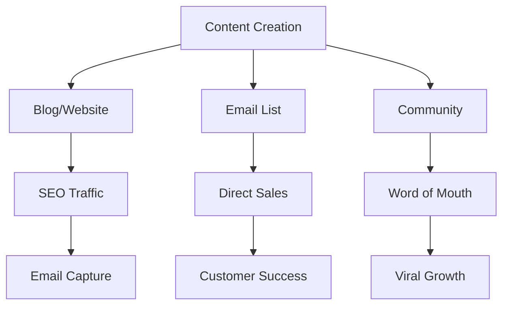

# The UltraPlan Content Leverage System
## Based on Dan Koe's Digital Economics Philosophy

### 🧠 The One-Person Business Philosophy

> "The future belongs to individuals who can leverage technology to build personal monopolies." - Dan Koe

UltraPlan isn't just a tool—it's your path to digital sovereignty.

---

## The 7-Figure Content Framework

### Core Principle: Education + Entertainment + Transformation

```typescript
class KoeContentSystem {
  pillars = {
    philosophy: "Why creation > construction",
    education: "How to build digital assets",
    transformation: "Real results from real creators",
    vision: "The future of human potential"
  };

  distribution = {
    owned: ["Email list", "Blog", "Community"],
    earned: ["SEO", "Word of mouth", "Shares"],
    paid: ["Strategic ads", "Sponsorships"]
  };

  monetization = {
    front: "Free valuable content",
    middle: "UltraPlan subscription",
    back: "High-ticket implementation"
  };
}
```

---

## The Daily Content System

### 4-2-2-2 Framework (Koe's Golden Ratio)

**4 Educational Posts**
- How-to content
- Tutorials
- Case studies
- Breakdowns

**2 Inspirational Posts**
- Success stories
- Vision casting
- Philosophical insights
- Future predictions

**2 Personal Posts**
- Behind the scenes
- Lessons learned
- Failures and wins
- Journey updates

**2 Promotional Posts**
- Soft sells
- Value stacks
- Testimonials
- Offers

---

## Content Pillars & Themes

### Pillar 1: The Death of Traditional Development

**Monday: Philosophical Foundation**
```markdown
Topics:
- "Why 99% of developers will be obsolete by 2030"
- "The last generation of 'coders'"
- "Creation vs Construction: The new paradigm"
- "When AI becomes your technical co-founder"

Format:
- 2,000+ word essays
- Twitter threads (15-20 tweets)
- LinkedIn articles
- Medium publications
```

**Example Thread Structure:**
```
1/ The age of "learning to code" is dead.

The future belongs to those who can architect ideas,
not implement them.

Here's why this shift changes everything:

2/ Traditional path:
Idea → Learn to code (2 years) → Build (6 months) → Launch

New reality:
Idea → Describe → Deploy (60 minutes)

We've compressed years into hours.

3/ This isn't about "no-code" tools with limitations.

This is about AI that writes better code than 99% of developers.

Professional. Scalable. Yours.

[Continue for 15-20 tweets...]
```

### Pillar 2: The Sovereign Developer Movement

**Tuesday: Tactical Implementation**
```markdown
Topics:
- "How I built a $10k/month SaaS in 2 hours"
- "From English to Enterprise: The new stack"
- "Replace your dev team with AI"
- "The 2-Hour Creator Method"

Format:
- Step-by-step guides
- Video walkthroughs
- Live building sessions
- Template shares
```

**Content Template:**
```markdown
# How I Built a $10k/Month SaaS in 2 Hours

**The Old Way:**
- 6 months development
- $50k in developer costs
- 500+ hours of work
- Still full of bugs

**The UltraPlan Way:**
1. Described my idea (15 minutes)
2. AI generated the plan (5 minutes)
3. Reviewed and refined (20 minutes)
4. Built and deployed (80 minutes)

**The Results:**
- Live product in 2 hours
- First customer in 24 hours
- $10k MRR in 30 days
- Zero technical debt

[Detailed walkthrough...]
```

### Pillar 3: Digital Economics & Leverage

**Wednesday: Business Philosophy**
```markdown
Topics:
- "One person, million dollar business"
- "Digital leverage: Work once, earn forever"
- "Building personal monopolies with AI"
- "The economics of creation"

Format:
- Economic analysis
- Business breakdowns
- ROI calculations
- Future projections
```

### Pillar 4: The Creator's Journey

**Thursday: Personal Brand Building**
```markdown
Topics:
- "My journey from $0 to $1M"
- "Failures that led to breakthroughs"
- "Building in public: Real numbers"
- "What I learned from 1,000 creations"

Format:
- Personal stories
- Transparent metrics
- Lessons learned
- Community spotlights
```

---

## The Email Empire Strategy

### The Creator's Daily Brief

**Structure:**
```yaml
Send Time: 5:47 AM (Koe's optimal time)
Subject Lines: Curiosity + Benefit
Length: 300-500 words
CTA: Single, clear action

Daily Themes:
Monday: Big idea philosophy
Tuesday: Tactical tutorial
Wednesday: Success story
Thursday: Tool highlight
Friday: Week recap + challenge
Saturday: Community spotlight
Sunday: Vision cast
```

**Email Template:**
```markdown
Subject: The $150k developer vs. 60 minutes of AI

Hey Creator,

Traditional startup wisdom says you need:
- A technical co-founder (50% equity)
- $150k/year developer (if you can find one)
- 6-12 months to MVP

Here's what happened when Sarah ignored all that:

Tuesday: Had idea for productivity app
Wednesday: Described it to UltraPlan
Thursday: Launched to Product Hunt
Friday: First paying customer
Today: $8,400 MRR

Time invested: 2 hours
Money invested: $47
Equity given up: 0%

The old rules don't apply anymore.

Question is: What will you build today?

→ [Start Your 2-Hour Transformation]

Stay sovereign,
[Name]

P.S. Sarah's documenting her entire journey in our community. 
Join 12,847 creators building the future: [Link]
```

### Lead Magnet: The Sovereign Developer's Handbook

**Contents:**
```markdown
Chapter 1: The Death of Traditional Development
Chapter 2: The Rise of the Creator Economy
Chapter 3: Building Your First $10k App
Chapter 4: The 2-Hour Creator Method
Chapter 5: 50 Profitable App Ideas
Chapter 6: The Tech Stack That Builds Itself
Chapter 7: From Creator to CEO

Bonus: 10 App Templates Worth $50k
```

---

## Social Media Domination

### Twitter/X Strategy

**Daily Posting Schedule:**
```typescript
const twitterStrategy = {
  '6:00 AM': 'Philosophical thread (15-20 tweets)',
  '12:00 PM': 'Quick win or tip',
  '3:00 PM': 'Engage with community',
  '6:00 PM': 'Success story or case study',
  '9:00 PM': 'Inspirational or visionary'
};
```

**Thread Frameworks:**

1. **The Contrarian Take**
```
Everyone thinks you need to learn to code.

They're wrong.

Here's why the best developers of 2025 won't write a single line of code:

[Thread continues...]
```

2. **The Step-by-Step**
```
I built a complete SaaS in 2 hours yesterday.

$0 → $10k MRR potential.

Here's the exact process (anyone can do this):

[Thread continues...]
```

3. **The Prediction**
```
By 2026, 90% of software will be built by non-developers.

This isn't speculation.

Here are 7 trends that make this inevitable:

[Thread continues...]
```

### LinkedIn Strategy

**Format:** Long-form value posts

**Template:**
```markdown
I fired my entire development team last month.

Not because they were bad.
Because they became obsolete overnight.

Here's what happened:

[Story of transformation]

3 months ago:
• 5 developers
• $75k/month burn
• 3-month sprint cycles
• Constant technical debt

Today:
• Me + UltraPlan
• $47/month cost
• 2-hour development cycles
• Zero technical debt

The results speak for themselves:
→ 10x faster deployment
→ 99.8% cost reduction
→ Better code quality
→ Infinite scalability

The future doesn't need more developers.
It needs more creators.

Which side of history will you be on?

#DigitalTransformation #FutureOfWork #CreatorEconomy
```

### YouTube Strategy

**Channel Structure:**
```yaml
Weekly Upload Schedule:
  Monday: "Philosophy Monday" - 10-15 min essays
  Wednesday: "Build With Me Wednesday" - Live coding
  Friday: "Future Friday" - Predictions & vision

Content Types:
  - 2-Hour Creator Challenges
  - Start to Sale speedruns  
  - Creator Spotlight interviews
  - Technology deep dives
  - Business breakdowns
```

---

## The Content Multiplication System

### One Idea → 10 Pieces of Content

**Example: "Building a SaaS in 2 Hours"**

1. **Long-form Blog Post** (2,000 words)
2. **Twitter Thread** (15-20 tweets)
3. **LinkedIn Article** (1,000 words)
4. **YouTube Video** (15 minutes)
5. **YouTube Short** (60 seconds)
6. **TikTok** (30 seconds)
7. **Instagram Reel** (30 seconds)
8. **Email Newsletter** (500 words)
9. **Podcast Episode** (30 minutes)
10. **Community Case Study** (Exclusive)

### The Compound Effect

```python
def content_compound_effect(days):
    daily_pieces = 10
    total_content = daily_pieces * days
    
    # Each piece reaches average 1,000 people
    total_reach = total_content * 1000
    
    # 1% convert to email list
    email_subscribers = total_reach * 0.01
    
    # 5% of email list becomes customers
    customers = email_subscribers * 0.05
    
    # Average customer value $97/month
    monthly_revenue = customers * 97
    
    return {
        'content_pieces': total_content,
        'total_reach': total_reach,
        'email_list': email_subscribers,
        'customers': customers,
        'mrr': monthly_revenue
    }

# After 90 days:
# 900 pieces of content
# 900,000 people reached
# 9,000 email subscribers
# 450 customers
# $43,650 MRR
```

---

## The Modern Marketing Ecosystem

### Owned Media Empire


### The Flywheel Effect

1. **Create Value** → Attract Audience
2. **Build Trust** → Grow Email List
3. **Solve Problems** → Convert to Customers
4. **Deliver Results** → Generate Testimonials
5. **Share Success** → Attract More Audience

*The wheel spins faster with each rotation.*

---

## Monetization Through Value

### The Value Ladder (Koe Style)

```yaml
Free Tier: "Taste the Transformation"
  - Daily content
  - Community access
  - Basic resources
  Value: Build trust

Low Ticket: "Start Creating" ($47/mo)
  - UltraPlan access
  - Group coaching
  - Templates
  Value: Quick wins

Mid Ticket: "Scale Your Empire" ($497/mo)
  - Everything above
  - 1-on-1 calls
  - Advanced features
  Value: Serious results

High Ticket: "Partnership Level" ($2,997/mo)
  - Everything above
  - Direct access
  - Revenue share
  - Custom solutions
  Value: Life changing
```

---

## Implementation Roadmap

### Week 1: Foundation
- [ ] Set up content calendar
- [ ] Create 30 pieces of cornerstone content
- [ ] Design email capture system
- [ ] Build community platform
- [ ] Establish daily creation habit

### Week 2: Distribution
- [ ] Launch on all platforms
- [ ] Begin daily posting
- [ ] Start email sequence
- [ ] Engage authentically
- [ ] Track what resonates

### Week 3: Optimization
- [ ] Double down on what works
- [ ] Cut what doesn't
- [ ] Refine messaging
- [ ] Increase frequency
- [ ] Build systems

### Week 4: Scale
- [ ] Delegate/automate repetitive tasks
- [ ] Focus on high-leverage activities
- [ ] Expand successful content types
- [ ] Deepen community engagement
- [ ] Prepare for launch

---

## The Ultimate Goal

Build a one-person business empire where:
- Content creates customers
- Customers create content
- Success creates more success
- You focus on vision, not tasks
- Income becomes inevitable

---

## Key Metrics to Track

```typescript
interface ContentMetrics {
  // Reach Metrics
  totalImpressions: number;
  uniqueViewers: number;
  shareRate: number;
  
  // Engagement Metrics
  averageTimeOnContent: number;
  commentRate: number;
  saveRate: number;
  
  // Conversion Metrics
  clickThroughRate: number;
  emailSignupRate: number;
  customerConversionRate: number;
  
  // Revenue Metrics
  revenuePerPiece: number;
  lifetimeValuePerContent: number;
  contentROI: number;
}

// Target Benchmarks
const targets = {
  emailSignupRate: 0.02,      // 2% of viewers
  customerConversion: 0.05,    // 5% of email list
  contentROI: 10,              // 10x return
  monthlyGrowth: 0.3           // 30% month-over-month
};
```

---

## Final Thoughts

> "The creator economy isn't about creating content. It's about creating leverage. One piece of value, infinite distribution, compound returns." - Dan Koe

With UltraPlan, you're not just building software.
You're building a sovereign creative empire.

The question isn't whether you'll succeed.
It's how big you're willing to dream.

**Start creating. Stop waiting.**

🚀 [Begin Your Journey at UltraPlan.pro](https://ultraplan.pro)