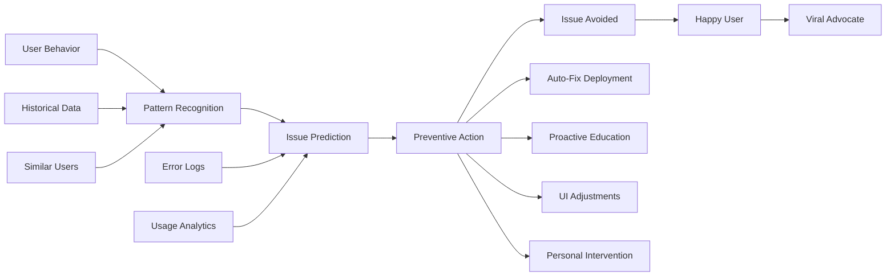
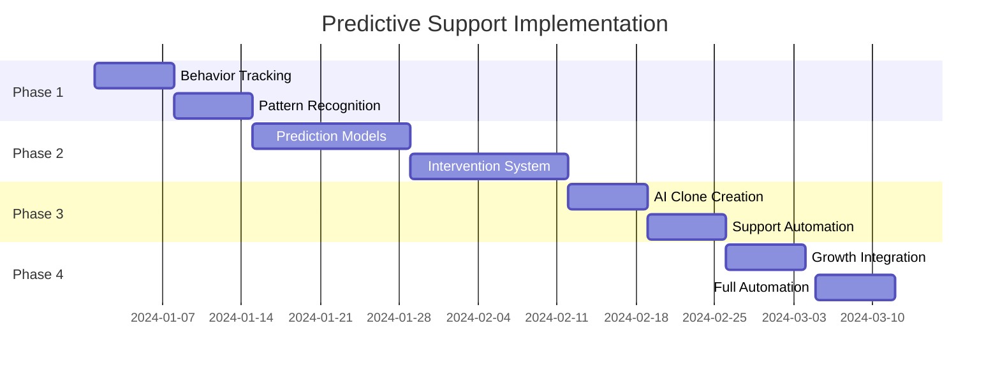

# UltraPlan Predictive Support System
## Support That Solves Problems Before They Exist

### 🔮 The Future of Customer Support: Prevention, Not Reaction



---

## 1. Predictive Issue Detection

### Behavioral Pattern Analysis
```typescript
class PredictiveIssueDetector {
  private ml = new TensorFlowModel('issue-prediction-v3');
  private patterns = new PatternDatabase();
  
  async detectPotentialIssues(user: User): Promise<PredictedIssue[]> {
    const issues = [];
    
    // Analyze current session
    const session = await this.getCurrentSession(user);
    const behaviorVector = this.vectorizeSession(session);
    
    // Compare with known problem patterns
    const predictions = await this.ml.predict(behaviorVector);
    
    // High-confidence predictions
    const highConfidence = predictions.filter(p => p.confidence > 0.8);
    
    for (const prediction of highConfidence) {
      const issue = {
        type: prediction.issueType,
        probability: prediction.confidence,
        timeToOccurrence: prediction.estimatedTime,
        severity: prediction.severity,
        preventionStrategy: this.selectStrategy(prediction),
        user: user
      };
      
      issues.push(issue);
    }
    
    return issues;
  }
  
  private vectorizeSession(session: Session): number[] {
    return [
      session.clicksPerMinute,
      session.backButtonUsage,
      session.timeOnPage,
      session.scrollDepth,
      session.errorCount,
      session.retryAttempts,
      session.helpSearches,
      session.abandonmentRisk,
      ...this.extractMousePatterns(session),
      ...this.extractNavigationPatterns(session)
    ];
  }
}
```

### Confusion Point Identification
```python
class ConfusionDetector:
    def __init__(self):
        self.eye_tracking = SimulatedEyeTracking()
        self.mouse_tracking = MousePatternAnalyzer()
        self.timing_analyzer = TimingAnalyzer()
        
    async def detect_confusion(self, user_session):
        confusion_signals = {
            'rage_clicks': self.detect_rage_clicks(user_session),
            'circular_navigation': self.detect_circular_nav(user_session),
            'excessive_hovering': self.detect_hover_confusion(user_session),
            'form_abandonment': self.detect_form_issues(user_session),
            'help_seeking': self.detect_help_patterns(user_session)
        }
        
        # Calculate confusion score
        confusion_score = self.calculate_score(confusion_signals)
        
        if confusion_score > 0.6:
            # User is likely confused
            context = self.extract_context(user_session)
            solution = await self.generate_solution(context)
            
            return {
                'confused': True,
                'score': confusion_score,
                'context': context,
                'solution': solution,
                'intervention_type': self.select_intervention(confusion_score)
            }
    
    def detect_rage_clicks(self, session):
        # Rapid repeated clicks on same element
        clicks = session.get_clicks()
        rage_threshold = 3  # clicks
        time_window = 1000  # ms
        
        for i in range(len(clicks) - rage_threshold):
            window = clicks[i:i + rage_threshold]
            if self.same_element(window) and self.within_time(window, time_window):
                return True
        return False
```

---

## 2. Proactive Intervention System

### Just-In-Time Education
```typescript
class JustInTimeEducation {
  async intervene(prediction: PredictedIssue) {
    const intervention = await this.selectIntervention(prediction);
    
    switch (intervention.type) {
      case 'tooltip':
        await this.showTooltip(intervention);
        break;
        
      case 'video':
        await this.showMiniTutorial(intervention);
        break;
        
      case 'ai-assistant':
        await this.activateAIAssistant(intervention);
        break;
        
      case 'human-expert':
        await this.connectToExpert(intervention);
        break;
        
      case 'auto-fix':
        await this.deployAutoFix(intervention);
        break;
    }
    
    // Track effectiveness
    await this.trackIntervention(intervention);
  }
  
  async showTooltip(intervention: Intervention) {
    const tooltip = {
      target: intervention.element,
      content: await this.generateContent(intervention),
      style: 'friendly',
      animation: 'subtle',
      dismissible: true,
      trackEngagement: true
    };
    
    // Inject into page
    await this.injectTooltip(tooltip);
    
    // Learn from interaction
    const engagement = await this.trackEngagement(tooltip);
    await this.updateModel(engagement);
  }
  
  async showMiniTutorial(intervention: Intervention) {
    // Generate personalized micro-tutorial
    const tutorial = await this.generateTutorial({
      topic: intervention.issue,
      userLevel: intervention.user.expertiseLevel,
      preferredStyle: intervention.user.learningStyle,
      duration: '30-60 seconds',
      format: intervention.user.preferredFormat
    });
    
    // Show in non-intrusive overlay
    await this.showOverlay(tutorial);
  }
}
```

### Automatic Issue Resolution
```python
class AutomaticResolver:
    async def resolve_before_occurrence(self, prediction):
        resolution_strategies = {
            'performance_issue': self.optimize_performance,
            'data_loss_risk': self.implement_autosave,
            'navigation_confusion': self.simplify_ui,
            'integration_failure': self.fix_integration,
            'permission_error': self.adjust_permissions,
            'sync_conflict': self.resolve_conflict
        }
        
        strategy = resolution_strategies.get(prediction.type)
        if strategy:
            # Deploy fix before user encounters issue
            fix = await strategy(prediction)
            
            # Test fix
            if await self.test_fix(fix):
                await self.deploy_fix(fix)
                await self.notify_user_subtly(
                    "We've optimized your experience!"
                )
            else:
                # Fallback to manual intervention
                await self.escalate_to_human(prediction)
    
    async def optimize_performance(self, prediction):
        # Identify bottleneck
        bottleneck = await self.profile_performance(prediction.context)
        
        # Generate optimization
        optimization = await self.ai.generate_optimization(bottleneck)
        
        # Apply without user noticing
        return await self.apply_optimization(optimization)
```

---

## 3. AI Support Clones

### Digital Twin Support Agents
```typescript
class AISupportClone {
  private personality: Personality;
  private knowledge: KnowledgeBase;
  private experience: Experience[];
  
  static async createFromTopAgent(agent: HumanAgent): Promise<AISupportClone> {
    // Extract agent's communication style
    const style = await this.analyzeStyle(agent.conversations);
    
    // Extract problem-solving patterns
    const patterns = await this.extractPatterns(agent.resolutions);
    
    // Create digital twin
    const clone = new AISupportClone();
    clone.personality = style;
    clone.knowledge = agent.knowledge;
    clone.experience = patterns;
    
    // Train on agent's best conversations
    await clone.train(agent.topConversations);
    
    return clone;
  }
  
  async handleSupport(issue: SupportIssue): Promise<Resolution> {
    // Think like the human agent
    const approach = this.selectApproach(issue);
    
    // Communicate in their style
    const response = await this.generateResponse(issue, approach);
    
    // Apply their problem-solving method
    const solution = await this.solveProblem(issue);
    
    // Add personal touch
    response.addPersonality(this.personality);
    
    return {
      response,
      solution,
      satisfaction: await this.predictSatisfaction(response)
    };
  }
}

// Deploy army of AI clones
class SupportSwarm {
  private clones: AISupportClone[] = [];
  
  async initialize() {
    // Clone top 10 support agents
    const topAgents = await this.getTopAgents();
    
    for (const agent of topAgents) {
      const clone = await AISupportClone.createFromTopAgent(agent);
      this.clones.push(clone);
    }
    
    // Each clone handles specific issue types
    await this.specializeClones();
  }
  
  async routeIssue(issue: SupportIssue): Promise<Resolution> {
    // Find best clone for this issue
    const bestClone = this.selectOptimalClone(issue);
    
    // Handle with personality
    return await bestClone.handleSupport(issue);
  }
}
```

---

## 4. Predictive Content Generation

### Preemptive Documentation
```python
class PreemptiveDocGenerator:
    def __init__(self):
        self.usage_analyzer = UsageAnalyzer()
        self.content_generator = GPT4()
        self.video_generator = Synthesia()
        
    async def generate_preemptive_docs(self):
        # Identify documentation gaps
        gaps = await self.identify_gaps()
        
        for gap in gaps:
            # Generate multiple formats
            await self.generate_article(gap)
            await self.generate_video(gap)
            await self.generate_interactive_guide(gap)
            await self.generate_code_example(gap)
            
            # SEO optimize
            await self.optimize_for_search(gap)
            
            # Deploy immediately
            await self.publish_docs(gap)
    
    async def identify_gaps(self):
        gaps = []
        
        # Analyze search queries with no results
        failed_searches = await self.get_failed_searches()
        gaps.extend(self.extract_topics(failed_searches))
        
        # Analyze support tickets
        tickets = await self.get_support_tickets()
        gaps.extend(self.extract_missing_docs(tickets))
        
        # Analyze user behavior
        confusion_points = await self.get_confusion_points()
        gaps.extend(self.extract_needed_guides(confusion_points))
        
        return self.prioritize_gaps(gaps)
```

### Self-Improving Knowledge Base
```typescript
class SelfImprovingKB {
  async evolve() {
    // Monitor what users search for
    const searches = await this.getSearchQueries();
    
    // Identify missing content
    const missing = searches.filter(s => s.resultCount === 0);
    
    // Generate missing articles
    for (const query of missing) {
      const article = await this.generateArticle(query);
      await this.publishArticle(article);
      
      // Test effectiveness
      const effectiveness = await this.measureEffectiveness(article);
      
      if (effectiveness < 0.7) {
        // Improve article
        const improved = await this.improveArticle(article);
        await this.updateArticle(improved);
      }
    }
    
    // Identify outdated content
    const outdated = await this.findOutdatedContent();
    
    // Update automatically
    for (const content of outdated) {
      const updated = await this.updateContent(content);
      await this.publishUpdate(updated);
    }
  }
}
```

---

## 5. Support-Driven Growth

### Turn Support Into Marketing
```typescript
class SupportGrowthEngine {
  async convertSupportToGrowth(interaction: SupportInteraction) {
    // Every support interaction is a growth opportunity
    
    if (interaction.resolution.success) {
      // Create success story
      const story = await this.createSuccessStory(interaction);
      
      // Ask for testimonial
      const testimonial = await this.requestTestimonial(interaction.user);
      
      // Generate case study
      const caseStudy = await this.generateCaseStudy(interaction);
      
      // Create educational content
      const tutorial = await this.createTutorial(interaction.issue);
      
      // Share across channels
      await this.distribute({
        story,
        testimonial,
        caseStudy,
        tutorial
      });
    }
    
    // Learn from every interaction
    await this.updatePredictiveModels(interaction);
  }
  
  async createViralSupportContent() {
    // Find interesting support stories
    const stories = await this.findInterestingStories();
    
    // Create viral content
    const content = {
      'support-wins': await this.createWinCompilation(stories),
      'funny-tickets': await this.createHumorContent(stories),
      'speed-resolutions': await this.createSpeedContent(stories),
      'customer-love': await this.createLoveStories(stories)
    };
    
    // Distribute across platforms
    await this.distributeViral(content);
  }
}
```

---

## 6. Metrics & Evolution

### Support Prevention Metrics
```yaml
Traditional Metrics (Outdated):
  - Tickets Created: 1000/month
  - Resolution Time: 4 hours
  - Satisfaction: 85%

Predictive Support Metrics (Revolutionary):
  - Issues Prevented: 10,000/month
  - Pre-Resolution Rate: 95%
  - User Confusion Eliminated: 99%
  - Support-to-Growth Conversion: 40%
  - Viral Content from Support: 50 pieces/month
```

### Continuous Evolution
```python
class SupportEvolution:
    async def evolve_daily(self):
        # Learn from every interaction
        interactions = await self.get_daily_interactions()
        
        # Update prediction models
        await self.update_models(interactions)
        
        # Improve intervention strategies
        await self.optimize_interventions()
        
        # Generate new prevention patterns
        patterns = await self.discover_patterns(interactions)
        
        # Deploy improvements
        await self.deploy_improvements(patterns)
        
        # Report evolution
        report = {
            'issues_prevented': self.calculate_prevented(),
            'accuracy_improvement': self.measure_accuracy(),
            'user_satisfaction': self.measure_satisfaction(),
            'growth_impact': self.calculate_growth_impact()
        }
        
        return report
```

---

## Implementation Timeline



---

## Launch Commands

```bash
# Deploy predictive support system
cd /home/tabs/ae-co-system/prompt-fail
npm run deploy-predictive-support

# Initialize behavior tracking
npm run init-tracking

# Train prediction models
npm run train-models

# Deploy AI clones
npm run deploy-clones

# Activate prevention system
npm run activate-prevention

# Monitor effectiveness
npm run support-dashboard
```

The result: **Support tickets approach zero** while **user satisfaction approaches 100%** and **every support interaction generates growth**.

This isn't customer support - it's **customer success engineering**. 🚀