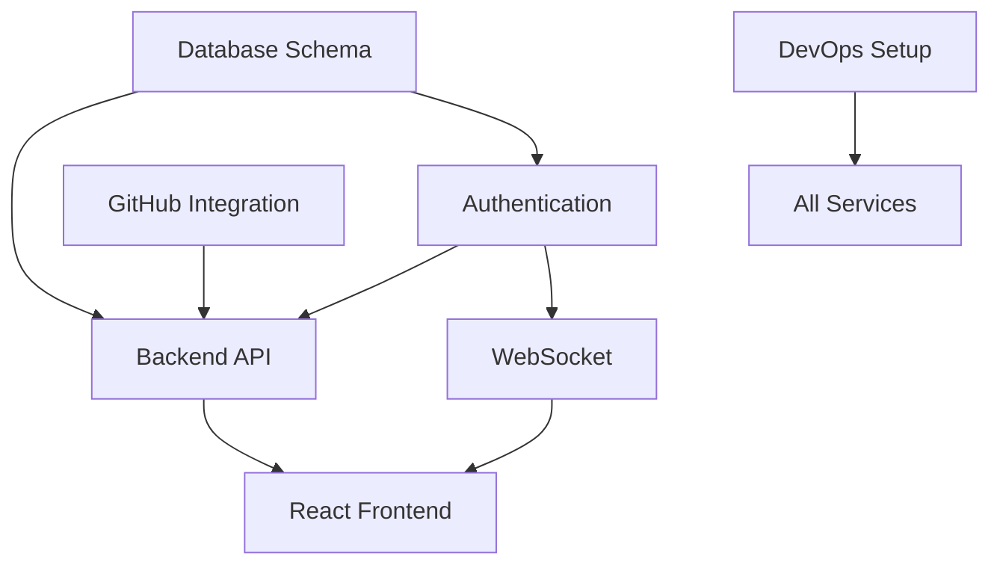

# CLDCDE Pro - Production-Ready Parallel Execution Plan

## Real Implementation - No Mocks, No Shortcuts

### Track 1: Database Foundation (DataSorcerer) - START IMMEDIATELY
**Day 1 Priority - Everything Depends on This**
```bash
# Morning (4 hours)
- Create production SQLite database
- Implement full schema with sqlx migrations
- Set up connection pooling
- Create indexes for performance

# Afternoon (4 hours)
- Build repository pattern with real queries
- Implement transaction management
- Set up database backup system
- Create seed data for development
```

**Deliverable**: Working database layer other teams can connect to

### Track 2: Authentication Core (SecurityMaster) - START IMMEDIATELY
**Real OAuth + JWT Implementation**
```rust
// Day 1: GitHub OAuth Setup
- Register GitHub OAuth App (production credentials)
- Implement full OAuth2 flow with octocrab
- Store tokens in database (encrypted)
- Build JWT generation with real claims

// Day 2: Session Management
- Implement secure session storage
- Build refresh token mechanism
- Add rate limiting (real Redis)
- Create permission system
```

### Track 3: Backend API (SystemArchitect) - START AFTER DB (Day 1 PM)
**Production Axum Server**
```rust
// Day 1 Afternoon: Core Setup
- Axum server with real middleware
- Connect to real database
- Implement error handling
- Set up structured logging

// Day 2: Real Endpoints
- User CRUD with actual DB queries
- Workflow management with transactions
- Repository sync with real GitHub API
- WebSocket server with authentication
```

### Track 4: GitHub Integration (CodeWhisperer) - START IMMEDIATELY
**Real GitHub API Integration**
```rust
// Day 1: Octocrab Setup
- Initialize with real GitHub token
- Implement repository listing
- Build commit history fetching
- Create webhook receivers

// Day 2: Advanced Features
- PR/Issue management
- Real-time webhook processing
- Repository cloning service
- GitHub Actions integration
```

### Track 5: Frontend with Real APIs (FrontendNinja) - START DAY 2
**Production React App**
```typescript
// Day 2: After API structure exists
- Create React app with real API client
- Implement actual fetch calls
- Build error handling for real responses
- Connect to real WebSocket server

// Day 3: Full Integration
- GitHub repository browser (real data)
- Workflow visualizer (real workflows)
- Live dashboard (real metrics)
- Production error boundaries
```

### Track 6: WebSocket Infrastructure (SystemArchitect + FrontendNinja) - DAY 2
**Production Real-time System**
```rust
// Backend (Day 2)
- tokio-tungstenite WebSocket server
- JWT authentication for connections
- Real message broadcasting
- Connection pool management

// Frontend (Day 2)
- Reconnection logic
- Real message handling
- State synchronization
- Heartbeat implementation
```

### Track 7: DevOps Production Setup (CloudOracle) - START IMMEDIATELY
**Real Infrastructure**
```yaml
# Day 1: Production Environment
- Production Docker images
- docker-compose with real services
- NGINX with SSL termination
- Production secrets management

# Day 2: Deployment Pipeline
- GitHub Actions for real deployment
- Database migration automation
- Blue-green deployment setup
- Real monitoring (Prometheus/Grafana)
```

### Track 8: Production Testing (QualityGuardian) - START DAY 2
**Real Test Suite**
```rust
// Day 2: After real services exist
- Integration tests against real database
- API tests with real endpoints
- E2E tests with real browser
- Load testing with real data

// Day 3: Production Validation
- Security scanning
- Performance benchmarks
- Chaos engineering tests
- Real user acceptance tests
```

## Critical Day 1 Sequence (MUST FOLLOW)

### Morning (0-4 hours)
1. **Database Schema** (DataSorcerer) - BLOCKS EVERYTHING
2. **GitHub OAuth App** (SecurityMaster) - Create real app
3. **Docker Environment** (CloudOracle) - Real services running
4. **GitHub Token** (CodeWhisperer) - Real API access

### Afternoon (4-8 hours)
1. **Database Ready** → Backend can start
2. **Auth Ready** → API can add authentication  
3. **API Structure Ready** → Frontend can start (Day 2)
4. **WebSocket Protocol** → Real-time features

## Real Integration Points

### Day 1 Evening Checkpoint
```bash
✓ Database accepting connections
✓ Auth system validating tokens
✓ API server responding
✓ GitHub API returning data
✓ Docker environment running
```

### Day 2 Integration
- Frontend connects to real API
- WebSocket uses real auth
- Tests run against real services
- Monitoring shows real metrics

### Day 3 Full System
- Complete production system running
- All real data flows working
- No mocks anywhere
- Ready for staging deployment

## Production Dependencies



## Parallel Execution Timeline

### Day 1
```
08:00-12:00
├── DataSorcerer: Database setup (CRITICAL PATH)
├── SecurityMaster: OAuth app + JWT
├── CloudOracle: Docker infrastructure  
└── CodeWhisperer: GitHub API client

12:00-17:00
├── DataSorcerer: Repository pattern
├── SecurityMaster: Session management
├── SystemArchitect: Backend server setup (DEPENDS ON DB)
├── CloudOracle: CI/CD pipeline
└── CodeWhisperer: Webhook handlers
```

### Day 2
```
08:00-17:00
├── SystemArchitect: Real API endpoints
├── FrontendNinja: React + real API calls
├── QualityGuardian: Integration tests
├── DataSorcerer: Performance optimization
└── CloudOracle: Monitoring setup
```

### Day 3
```
08:00-17:00
├── Full system integration
├── End-to-end testing
├── Performance validation
└── Staging deployment
```

## Success Metrics (Production Ready)

- [ ] Real GitHub OAuth login works
- [ ] Real repositories load from GitHub
- [ ] Real workflows persist to database
- [ ] Real WebSocket updates flow
- [ ] Real deployment to staging
- [ ] Real monitoring shows metrics
- [ ] Real tests pass in CI/CD
- [ ] Real users can use system

## No Mocks Checklist

❌ No MSW (Mock Service Worker)
❌ No in-memory databases
❌ No fake authentication
❌ No static test data
❌ No mock API responses
✅ Real database from day 1
✅ Real GitHub API from day 1
✅ Real authentication from day 1
✅ Real deployment from day 1
✅ Real monitoring from day 1

---
*Production-ready from commit #1 - No shortcuts, no technical debt*